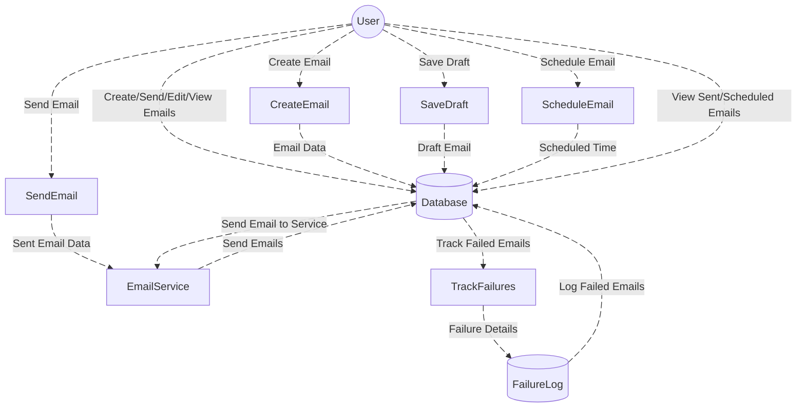
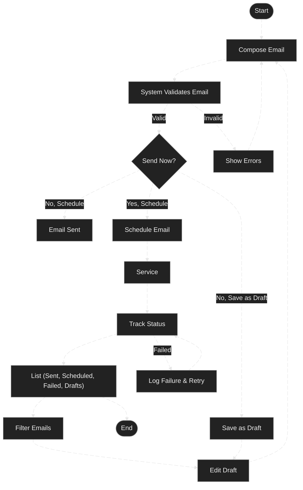
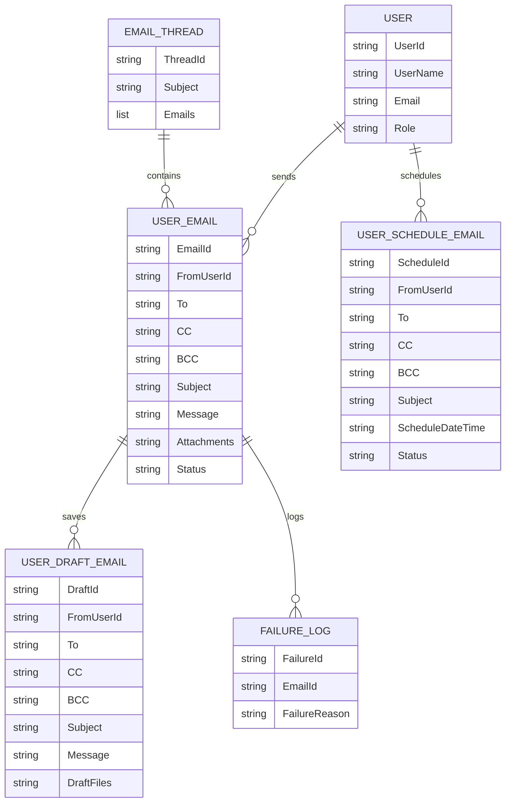

# Email Module Documentation

---

## **Overview**

The **Email Module** serves as the backbone of communication within the system, managing a comprehensive range of email-related operations with unmatched efficiency and precision. It handles everything from the seamless creation and editing of emails to the sophisticated scheduling and timely delivery of messages. Beyond basic sending, this powerhouse module tracks email statuses meticulously—whether it's a successful delivery, a pending message, or a failed attempt—ensuring that no communication is ever lost.

Designed to meet the needs of modern businesses, the Email Module offers users full control over their email activities, allowing them to manage drafts, review sent emails, and swiftly identify any failures or delivery issues. It seamlessly integrates with key system components, such as CRM, task management, and document storage, to create a unified communication experience.

Whether you're sending invoices, client updates, or internal notifications, the Email Module empowers users with advanced features like automated retries for failed emails, detailed status tracking, and effortless email rescheduling. It acts as a central hub for all email-related tasks, ensuring that no message ever goes unnoticed or untracked.

From drafting personalized messages to automating email workflows, this module is engineered to enhance efficiency and streamline communication processes, making it indispensable for every team within the system. With its robust functionality, the Email Module ensures that email management is no longer a chore, but a seamless, integrated experience that drives productivity and fosters communication across the entire organization.

---

## **DFD (Data Flow Diagram)**

---

## **Process Flow  (Process Flow Diagram)**

---

## **ER Diagram (Entity-Relationship Diagram)**

---

## **Entity Definitions**

1. **Email**: Contains the details of an email message, including the sender, recipients (To, CC, BCC), subject, message body, attachments, and status.
2. **User**: Represents users of the system, each with a specific role (Admin, Manager, Staff) that determines their access to email-related features.
3. **Draft**: An email that is saved but not sent yet. It is stored temporarily and can be modified later before being sent.
4. **Scheduled Email**: A scheduled email that is set to be sent at a later time. The system processes these emails and sends them at the scheduled time.
5. **Sent Email**: Represents an email that has been successfully dispatched to recipients.
6. **Failure Log**: Stores information about failed email attempts, such as the reason for failure, time of failure, and any error messages.

---

## **Authentication / APIs**

### **Authentication**

- **Role-Based Access Control (RBAC)**: The **Email Module** uses RBAC for authentication, meaning that different user roles have different access levels and permissions.
- **JWT Tokens**: Users must authenticate via JWT (JSON Web Tokens) to access the system's email-related services.

### **API Endpoints**

| **Description**                         | **HTTP Method** | **Endpoint**                                                                 |
|-----------------------------------------|-----------------|-----------------------------------------------------------------------------|
| **Send Email**                          | POST            | [/SendEmail](https://emails.servicesuat.actingoffice.com/swagger/index.html](https://apiuat.actingoffice.com/api-docs/index.html?urls.primaryName=Acting+Office+-+CRM)) |
| **Get Canned Messages**                 | GET             | [/CannedMessages](https://emails.servicesuat.actingoffice.com/swagger/index.html](https://apiuat.actingoffice.com/api-docs/index.html?urls.primaryName=Acting+Office+-+CRM)) |
| **Add New Draft**                       | POST            | [/SaveDraft](https://emails.servicesuat.actingoffice.com/swagger/index.html](https://apiuat.actingoffice.com/api-docs/index.html?urls.primaryName=Acting+Office+-+CRM)) |
| **Update Draft**                        | POST            | [/SaveDraft/{id}](https://emails.servicesuat.actingoffice.com/swagger/index.html](https://apiuat.actingoffice.com/api-docs/index.html?urls.primaryName=Acting+Office+-+CRM)) |
| **Get Draft Emails**                    | GET             | [/GetDraftMails](https://emails.servicesuat.actingoffice.com/swagger/index.html](https://apiuat.actingoffice.com/api-docs/index.html?urls.primaryName=Acting+Office+-+CRM)) |
| **Download Draft File**                 | GET             | [/DraftFileDownload](https://emails.servicesuat.actingoffice.com/swagger/index.html](https://apiuat.actingoffice.com/api-docs/index.html?urls.primaryName=Acting+Office+-+CRM)) |
| **Get Schedule Emails**                 | GET             | [/GetScheduleMails](https://emails.servicesuat.actingoffice.com/swagger/index.html](https://apiuat.actingoffice.com/api-docs/index.html?urls.primaryName=Acting+Office+-+CRM)) |
| **Add Schedule**                        | POST            | [/SaveSchedule](https://emails.servicesuat.actingoffice.com/swagger/index.html](https://apiuat.actingoffice.com/api-docs/index.html?urls.primaryName=Acting+Office+-+CRM)) |
| **Update Schedule**                     | POST            | [/SaveSchedule/{id}](https://emails.servicesuat.actingoffice.com/swagger/index.html](https://apiuat.actingoffice.com/api-docs/index.html?urls.primaryName=Acting+Office+-+CRM)) |
| **Update Schedule**                     | POST            | [/UpdateSchedule/{id}](https://emails.servicesuat.actingoffice.com/swagger/index.html](https://apiuat.actingoffice.com/api-docs/index.html?urls.primaryName=Acting+Office+-+CRM)) |
| **Get Schedule by ID**                  | GET             | [/schedule/{id}](https://emails.servicesuat.actingoffice.com/swagger/index.html](https://apiuat.actingoffice.com/api-docs/index.html?urls.primaryName=Acting+Office+-+CRM)) |
| **Send Scheduled Email**                | POST            | [/SendSchedule/{id}](https://emails.servicesuat.actingoffice.com/swagger/index.html](https://apiuat.actingoffice.com/api-docs/index.html?urls.primaryName=Acting+Office+-+CRM)) |
| **Download Schedule File**              | GET             | [/ScheduleFileDownload](https://emails.servicesuat.actingoffice.com/swagger/index.html](https://apiuat.actingoffice.com/api-docs/index.html?urls.primaryName=Acting+Office+-+CRM)) |

---

## **Testing Guide**

### **Unit Testing**

- **Email Creation**: Ensure that emails can be created and saved correctly.
- **Draft Saving**: Test the ability to save emails as drafts and retrieve them.
- **Email Sending**: Test the email sending logic, including successful delivery and failure handling.

### **Integration Testing**

- **Email Service Integration**: Verify that the email service (SMTP or third-party) is integrated properly with the system for sending emails.
- **Database Integration**: Ensure that emails are correctly stored in the database and that all metadata (e.g., recipient, subject, status) is saved appropriately.

### **End-to-End Testing**

- **End-to-End Flow**: Test the complete process from email creation, saving as a draft, scheduling, and sending to failure handling and retries.
- **UI Testing**: Ensure that users can interact with the email interface as expected, including creating, editing, and managing emails.

### **API Testing**

- Use **Postman** or **Swagger** to test the various API endpoints.
- Test edge cases such as missing required fields or invalid email addresses.

---

## **References**

- **Email Service API Documentation**: [Link to email service API documentation].
- **Fluent UI Documentation**: [Link to Fluent UI documentation].
- **Capsitech Storage and Services**: [Link to Capsitech documentation].

---

