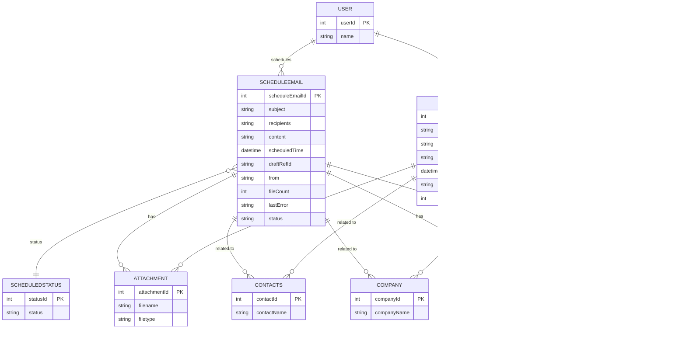

# Schedule Email Feature Documentation

## Overview
The **Schedule Email** feature allows users to schedule emails to be sent at a later time, manage drafts, and track their statuses. This functionality integrates with popular email services (Gmail, Outlook) using their APIs, enabling email delivery automation. It provides features for scheduling, rescheduling, and managing draft emails, as well as handling email failures through retry mechanisms.

### Key Functionalities:
- **Scheduling Emails**: Allows users to set a specific date and time for sending emails, along with attachments (such as invoices, quotes, engagement letters, etc.).
- **Draft Management**: Users can save emails as drafts, allowing them to review and edit them before sending them.
- **Rescheduling**: Users have the ability to reschedule the email to a different time.
- **Monitoring Scheduled Emails**: The feature provides functionality to track the status of scheduled emails (e.g., Sent, Pending, Failed).
- **Notifications on Failure**: If a scheduled email fails to send, users are notified, and the system attempts to resend it.

---

## DFD (Data Flow Diagram)

---

## Process Flow

---

## ER Diagram

---

## Entity Definition
- **User**: Represents the sender with properties such as email, name, and roles.
- **ScheduleEmail**: Contains details of the scheduled email such as recipients (To, Cc, Bcc), subject, message, scheduled time, and attachments.
- **DraftEmail**: Stores the draft of an email that is not yet sent.
- **ScheduledStatus**: The status of the scheduled email (Pending, Sent, Failed).
- **Attachment**: A file attached to the email (e.g., invoices, quotes).

---

## Authentication / APIs

### **Authentication**

- **Role-Based Access Control (RBAC)**: The **Email Module** uses RBAC for authentication and authorization. Access to this module is restricted using `[Authorize(Roles = "ADMIN,MANAGER,STAFF")]`, ensuring that only users with **ADMIN**, **MANAGER**, or **STAFF** roles can access it.

  
| **Description**                          | **HTTP Method** | **Endpoint URL**                                                                 |
|------------------------------------------|-----------------|----------------------------------------------------------------------------------|
| **Save the scheduled email**             | POST            | [POST /SaveSchedule](https://apiuat.actingoffice.com/api-docs/index.html?urls.primaryName=Acting+Office+-+CRM#/SaveSchedule) |
| **Update an existing scheduled email**   | POST            | [POST /UpdateSchedule](https://apiuat.actingoffice.com/api-docs/index.html?urls.primaryName=Acting+Office+-+CRM#/UpdateSchedule) |
| **Fetch a list of scheduled emails**     | GET             | [GET /GetScheduleEmails](https://apiuat.actingoffice.com/api-docs/index.html?urls.primaryName=Acting+Office+-+CRM#/GetScheduleEmails) |
| **Send the scheduled email through external APIs** | POST            | [POST /SendSchedule](https://apiuat.actingoffice.com/api-docs/index.html?urls.primaryName=Acting+Office+-+CRM#/SendSchedule) |
| **Download attachments of a scheduled email** | GET             | [GET /ScheduleFileDownload](https://apiuat.actingoffice.com/api-docs/index.html?urls.primaryName=Acting+Office+-+CRM#/ScheduleFileDownload) |

---

## Testing Guide
- **Unit Testing**: Tests for individual components like **ScheduleSend** and **ProcessScheduleEmail** to ensure email scheduling functionality works as expected.
- **Integration Testing**: Tests interaction with external email APIs (Gmail, Outlook) to ensure emails are sent at the correct time.
- **Error Handling Testing**: Tests for email failures and proper retry mechanisms handled by **ProcessFailedScheduleEmails**.
- **UI Testing**: Verifies the **ScheduleEmailList** component works for scheduling, rescheduling, and managing drafts.

---

## References
- **EmailService**: Core service that interacts with Gmail, Outlook, and other external email APIs.
- **OAuth Authentication**: OAuth 2.0 for secure email service access.

---

