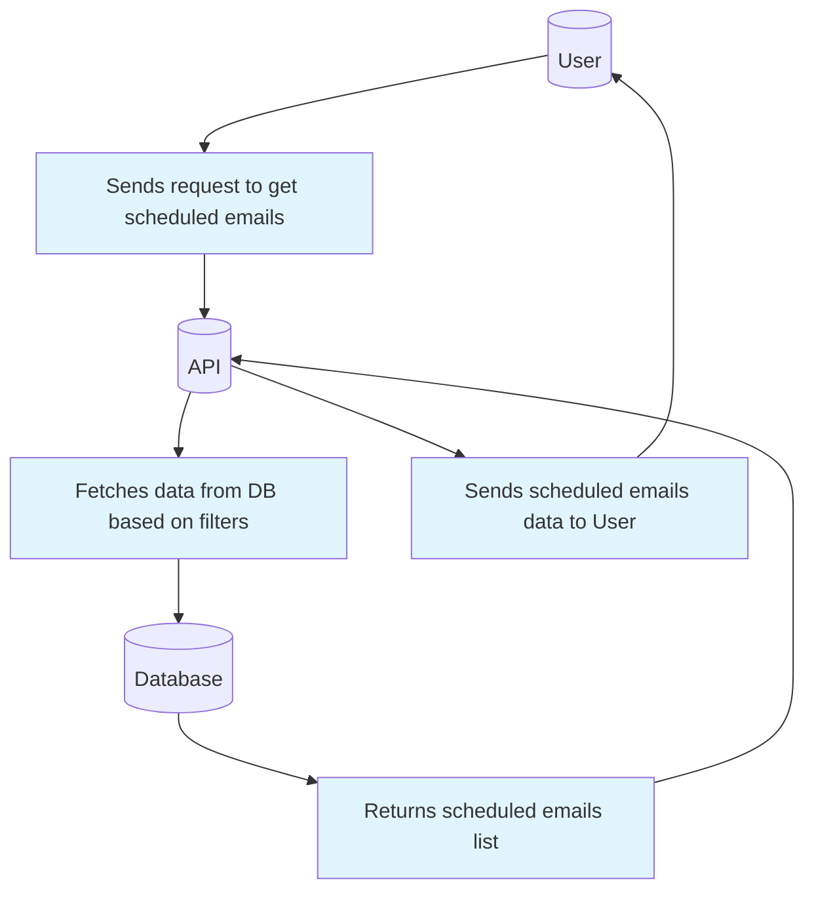
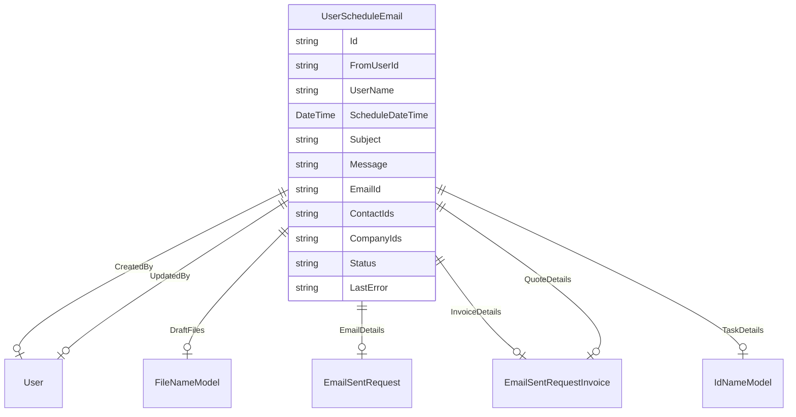

# Scheduled Email List Documentation

## Overview
The **Scheduled Email List** feature provides an interface to retrieve and manage scheduled emails, allowing users to view, filter, and manage emails that are set to be sent at a later time. The feature interacts with the backend database to fetch scheduled emails based on various filters such as user ID, company ID, contact ID, status, etc. The email details include subject, schedule time, file count, status, and any errors encountered during scheduling.

This feature also allows users to update the scheduled email’s time or associated details using the `SaveSchedule` API endpoint, providing flexibility in managing the sending of emails.

---

## DFD (Data Flow Diagram)

---

## Process Flow
1. **User Requests Scheduled Emails**: 
   - The user makes a request to retrieve a list of scheduled emails, optionally applying filters (e.g., user ID, company ID, etc.).
   
2. **API Filters Data**: 
   - The API applies the specified filters to the database query. Filters may include status (pending, failed), user ID, company ID, contact ID, etc.

3. **Database Query**: 
   - The database query aggregates the results, counting the total number of records matching the filters.

4. **Data Formatting and Conversion**: 
   - The retrieved emails are formatted with appropriate fields and timestamps, converting UTC times to practice time based on the user's time zone.

5. **Return Data to User**: 
   - The API returns the scheduled emails along with metadata (e.g., status, error messages, etc.) to the user.

6. **Email Scheduling Update**:
   - Users can update the scheduled email time and details via the `SaveSchedule` API. This allows users to reschedule emails or modify other related fields.

---

## ER Diagram

---

## Entity Definition

### `UserScheduleEmail`
- **Id**: The unique identifier for the scheduled email.
- **FromUserId**: The user who drafted the email.
- **UserName**: The name of the user who drafted the email.
- **ScheduleDateTime**: The date and time when the email is scheduled to be sent.
- **Subject**: The subject of the email.
- **Message**: The body content of the email.
- **EmailId**: The email ID associated with the scheduled email.
- **ContactIds**: List of contact IDs associated with the email.
- **CompanyIds**: List of company IDs associated with the email.
- **Status**: The current status of the scheduled email (e.g., PendingSend, Sent, Failed).
- **LastError**: Any error message encountered during the scheduling process.
- **DraftFiles**: A list of files attached to the email draft.

### `UserScheduleEmailStatus`
- **PendingSend**: The email is scheduled but not yet sent.
- **Sent**: The email has been successfully sent.
- **Failed**: The email failed to send.

---

## Authentication / APIs

### Authentication
The API requires authentication via user credentials. This is handled using OAuth or JWT (JSON Web Token) to ensure secure access to the scheduled emails data.

### API Endpoints
- **GET** `/GetScheduleMails`
  - Retrieves a paginated list of scheduled emails based on the provided filters (e.g., status, user ID, company ID).
  - **Query Parameters**:
    - `start`: The starting record for pagination.
    - `length`: The number of records to fetch.
    - `search`: A search term to filter emails by subject, username, or email ID.
    - `userId`, `companyId`, `contactId`: Filters for specific user, company, or contact.
    - `status`: Filter for the email's status (e.g., pending, sent, failed).

- **POST** `/SaveSchedule/{id}`
  - Allows users to update an existing scheduled email’s details, including the scheduled send time.
  - **Body Parameters**:
    - `datetime`: The new scheduled date and time.
    - `model`: The updated email details (e.g., recipients, subject, message).

---

## Testing Guide

### Test Cases for **GET** `/GetScheduleMails`
1. **Test for valid status filter**:
   - Query with `status=0` to retrieve emails with pending status.
   - Ensure the correct emails are returned.
   
2. **Test for search functionality**:
   - Query with a search term like "Invoice" and ensure the emails returned contain that keyword in the subject or body.
   
3. **Test for pagination**:
   - Test by setting `start=0` and `length=10`, then check if the result returns only 10 records.
   
4. **Test for invalid filters**:
   - Query with an invalid user ID and ensure an empty list is returned.

### Test Cases for **POST** `/SaveSchedule/{id}`
1. **Test for updating the schedule**:
   - Send a valid request to update the schedule time and check if the scheduled time is correctly updated in the database.
   
2. **Test for invalid email data**:
   - Attempt to send an email without a subject and verify that the API returns an error message.

---

## References
- **MongoDB Aggregation Framework**: https://docs.mongodb.com/manual/core/aggregation/
- **JSON Web Tokens**: https://jwt.io/introduction/
- **ASP.NET Core Authentication**: https://docs.microsoft.com/en-us/aspnet/core/security/authentication/
