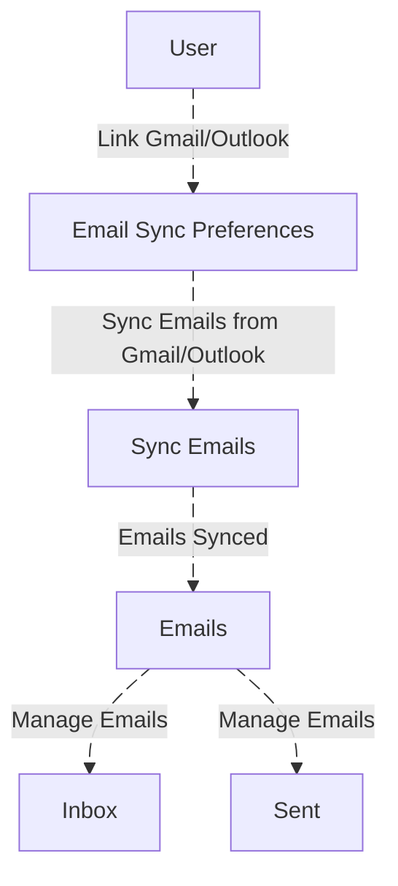
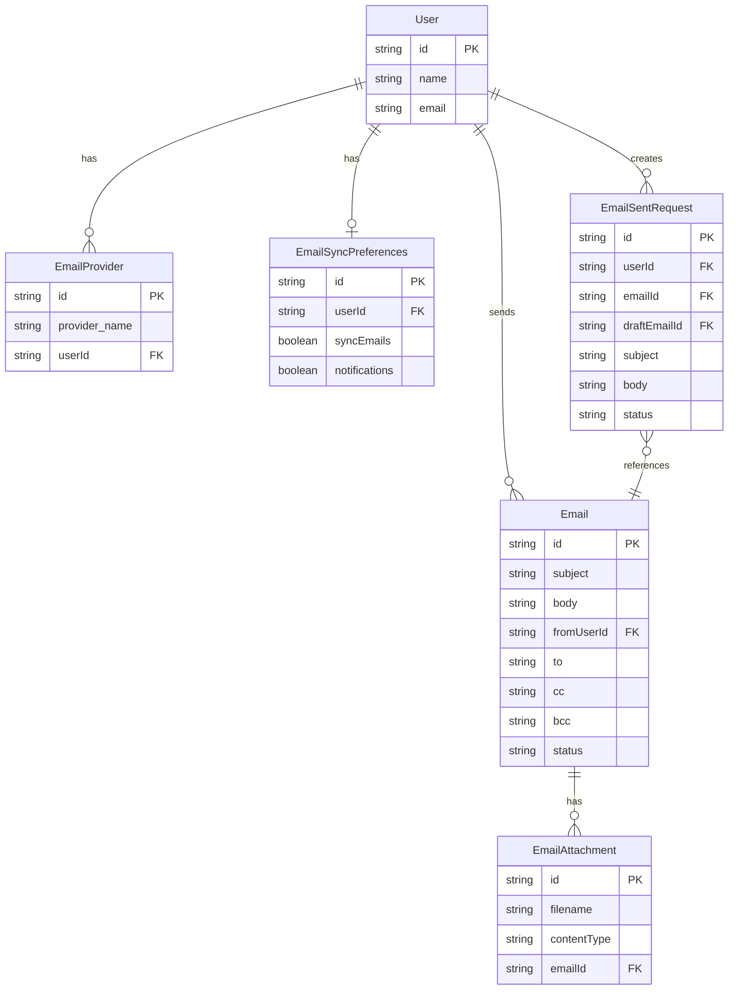

# Sync Email Documentation

## Overview
This document provides a detailed explanation of the email synchronization functionality within the application. The users can link either their Microsoft Outlook or Google Gmail accounts to the application. Once linked, they can perform various email-related operations directly within the app, such as sending, receiving, and managing emails.

### Key Functionalities:
- Users can link their Gmail or Outlook account.
- Email sync preferences allow users to choose between syncing all emails or no emails.
- Email notifications can be toggled on/off.
- The system ensures seamless integration with both Gmail and Microsoft Outlook for full email functionality.

## DFD (Data Flow Diagram)

## Process Flow
1. **Linking an Email Account**:
   - Users authenticate their email provider (Gmail/Outlook).
   - The system fetches authentication tokens for the user to link their email account.

2. **Sync Preferences**:
   - The user selects their email sync preferences (All Mail Sync or No Sync).
   - The system syncs the emails based on the selected preference.

## ER Diagram (Entity Relationship Diagram)

# Entity Definitions

## User
Represents a user in the system who can send and receive emails.
- id: Unique identifier
- name: User's full name
- email: User's email address

## EmailProvider
Stores email service provider connections for users (Gmail, Outlook, etc.).
- id: Unique identifier
- provider_name: Name of the provider (Gmail, Outlook, SMTP)
- userId: Reference to User
- access_token: OAuth token for authentication
- refresh_token: Token for refreshing access

## EmailSyncPreferences
User preferences for email synchronization.
- id: Unique identifier
- userId: Reference to User
- syncEmails: Whether to sync emails automatically
- notifications: Whether to enable notifications
- syncFrequency: How often to sync (in minutes)
- lastSyncTime: Last successful sync timestamp

## Email
Represents an email message.
- id: Unique identifier
- subject: Email subject
- body: Email content
- fromUserId: Reference to sender User
- to: Recipient addresses (comma-separated)
- cc: CC recipients
- bcc: BCC recipients
- status: Current status (draft, sent, failed, scheduled)
- sentAt: When the email was sent
- createdAt: Creation timestamp

## EmailAttachment
Files attached to emails.
- id: Unique identifier
- filename: Original file name
- contentType: File MIME type (e.g., application/pdf, image/jpeg)
- emailId: Reference to Email
- fileSize: Size in bytes
- storageUrl: Where the file is stored

## EmailSentRequest
Tracks email sending requests with metadata.
- id: Unique identifier
- userId: Reference to requesting User
- emailId: Reference to Email (once created)
- draftEmailId: Reference to source DraftEmail (optional)
- subject: Email subject
- body: Email body
- status: Request status (pending, sent, failed, cancelled)
- recipients: JSON array of recipient details
- attachments: JSON array of attachment references
- createdAt: Request timestamp
- processedAt: Processing timestamp

## Authentication / APIs

### **Authentication**

- **Role-Based Access Control (RBAC)**: The **Email Module** uses RBAC for authentication and authorization. Access to this module is restricted using `[Authorize(Roles = "ADMIN,MANAGER,STAFF")]`, ensuring that only users with **ADMIN**, **MANAGER**, or **STAFF** roles can access it.

### **API Endpoints**

| **Description**                                   | **HTTP Method** | **Endpoint URL**                                                                |
|---------------------------------------------------|-----------------|---------------------------------------------------------------------------------|
| **Microsoft OAuth Authentication**                |                 |                                                                                 |
| Initiates OAuth flow for Outlook                  | GET             | [GET /Addons/Microsoft/Link](https://apiuat.actingoffice.com/api-docs/index.html?urls.primaryName=Acting+Office+-+CRM#/Addons/Microsoft/Link) |
| Callback endpoint after user authentication       | GET             | [GET /Addons/Microsoft/AuthCallback](https://apiuat.actingoffice.com/api-docs/index.html?urls.primaryName=Acting+Office+-+CRM#/Addons/Microsoft/AuthCallback) |
| **Google OAuth Authentication**                  |                 |                                                                                 |
| Initiates OAuth flow for Gmail                    | GET             | [GET /Addons/Google/Link](https://apiuat.actingoffice.com/api-docs/index.html?urls.primaryName=Acting+Office+-+CRM#/Addons/Google/Link) |
| Callback endpoint after user authentication       | GET             | [GET /Addons/Google/AuthCallback](https://apiuat.actingoffice.com/api-docs/index.html?urls.primaryName=Acting+Office+-+CRM#/Addons/Google/AuthCallback) |
| **API Endpoints**                                 |                 |                                                                                 |
| Fetches a list of emails (Inbox/Sent)             | GET             | [GET /Emails](https://apiuat.actingoffice.com/api-docs/index.html?urls.primaryName=Acting+Office+-+CRM#/Emails) |
| Sends an email to the specified recipients        | POST            | [POST /Emails/Send](https://apiuat.actingoffice.com/api-docs/index.html?urls.primaryName=Acting+Office+-+CRM#/Emails/Send) |
| Retrieves emails from a particular thread         | GET             | [GET /Emails/Threads/{id}](https://apiuat.actingoffice.com/api-docs/index.html?urls.primaryName=Acting+Office+-+CRM#/Emails/Threads/{id}) |

---

## **Testing Guide**

### **Unit Testing**

- **Email Creation**: Ensure that emails can be created and saved correctly.
- **Draft Saving**: Test the ability to save emails as drafts and retrieve them.
- **Email Sending**: Test the email sending logic, including successful delivery and failure handling.

### **Integration Testing**

- **Email Service Integration**: Verify that the email service (SMTP or third-party) is integrated properly with the system for sending emails.
- **Database Integration**: Ensure that emails are correctly stored in the database and that all metadata (e.g., recipient, subject, status) is saved appropriately.

### **End-to-End Testing**

- **End-to-End Flow**: Test the complete process from email creation, saving as a draft, scheduling, and sending to failure handling and retries.
- **UI Testing**: Ensure that users can interact with the email interface as expected, including creating, editing, and managing emails.

### **API Testing**

- Use **Postman** or **Swagger** to test the various API endpoints.
- Test edge cases such as missing required fields or invalid email addresses.

---

## References
- [Microsoft Authentication Documentation](https://learn.microsoft.com/en-us/azure/active-directory/develop/)
- [Google OAuth Documentation](https://developers.google.com/identity/protocols/oauth2)
