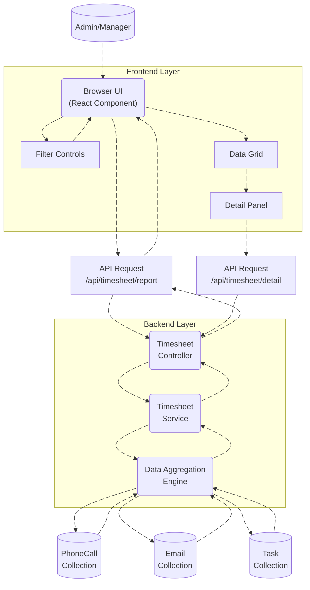
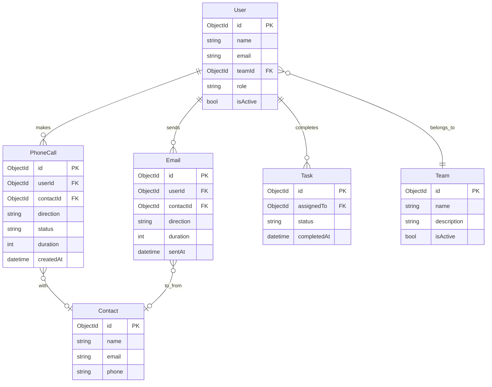

# Calls & Emails Report - Workflow Documentation

## Overview

The **Calls & Emails Report** is a comprehensive time tracking and productivity analysis tool designed for managers and administrators to monitor team communication activities. This report provides detailed insights into employee performance by tracking the time spent on phone calls and email communications, along with task completion metrics. The system aggregates data from multiple sources to present a unified view of individual and team productivity.

### Key Features

1. **Time Tracking**: Monitors total time spent on incoming/outgoing calls and email communications
2. **Performance Metrics**: Calculates averages, counts, and totals for calls and emails per user
3. **Team Filtering**: Allows filtering by team for targeted analysis
4. **Date Range Selection**: Customizable date ranges for flexible reporting periods
5. **Status Filtering**: Filter users by recorded time or empty timesheets
6. **Drill-Down Capability**: Click-through functionality to view detailed activity breakdowns
7. **Real-Time Aggregation**: Dynamic calculation of totals and averages across all users
8. **Task Completion Tracking**: Monitors number of tasks completed by each user

### Business Value

- **Resource Optimization**: Identify high and low performers based on communication time
- **Workload Balancing**: Understand time distribution across team members
- **Performance Evaluation**: Use data-driven metrics for performance reviews
- **Trend Analysis**: Track productivity patterns over custom date ranges
- **Communication Efficiency**: Analyze average call/email duration for process improvements

---

## Data Flow Diagram (DFD)

# Process Flow

The **Calls & Emails Process Flow** involves a series of steps that occur between the user and the system, starting from the user interaction on the frontend to the display of the communication report. The flow is as follows:

1. **User Interaction**: 
   - The user selects a team or user from the UI and applies any necessary filters such as date range, weekends inclusion, and specific teams.
   
2. **Frontend Request**:
   - Based on the user's selections, the frontend UI makes a request to the backend to fetch the communication data (calls and emails) for the selected user or team. The request includes the necessary parameters (e.g., `userId`, `fromDate`, `toDate`, `sortCol`, etc.).

3. **Backend Processing**:
   - The backend processes the request by querying the database for the required data. It aggregates communication statistics like incoming/outgoing calls, email statuses (inbox, sent, draft), and the total communication metrics.
   - The backend also handles any additional logic, such as excluding weekends if specified by the user.

4. **Data Aggregation**:
   - The backend aggregates the data and prepares it for response. This includes calculating the totals (e.g., total calls, total emails) and ensuring that the data is properly sorted based on the provided parameters.

5. **Return Data**:
   - The aggregated data is sent back to the frontend UI. This data includes the communication statistics based on the user's filters.

6. **UI Update**:
   - The frontend UI receives the data and updates the display accordingly. The communication report is shown to the user, with all the relevant details for the selected team or user.

7. **User View**:
   - The user can now view the communication report with detailed information, such as the number of calls, emails, and overall activity.

---

##  ER Diagram

## Entity Descriptions

### User
Represents employees tracked in the report. Contains name, email, team assignment, and role (ADMIN/MANAGER/STAFF). Each row in the report shows one user's aggregated activity.

### Team
Groups users for organizational filtering. Used in the team dropdown to view specific team performance.

### PhoneCall
Records individual phone calls with duration, direction (incoming/outgoing), and status. Aggregated to calculate total call time, count, and averages per user.

### Email
Records individual emails with duration and direction (sent/received). Aggregated to calculate total email time, count, and averages per user.

### Task
Tracks work tasks assigned to users. Only completed tasks within the date range are counted in the report.

### Contact
External people that users communicate with. Links to phone calls and emails, displayed in the detail panel.

---
# Authentication/API Endpoints

This section outlines the API routes and authentication used in the Timesheet Dashboard.

### **Authentication**
The **Team Report** endpoint requires an **ADMIN** or **MANAGER** role to access. The backend is protected using role-based access control (RBAC) with the `[Authorize]` attribute.

## **API Endpoints:**

| **Description**                   | **HTTP Method**   | **Endpoint**                                                                 |
|-----------------------------------|-------------------|-----------------------------------------------------------------------------|
| **Get Report**           | GET               | [/Report](https://apiuat.actingoffice.com/api-docs/index.html?urls.primaryName=Acting+Office+-+CRM) |

# Testing Guide

### Unit Tests

- **API Testing**: 
  - Test `GET /userreport` and `GET /Report` endpoints with valid and invalid parameters (e.g., `userId`, `fromDate`, `toDate`).
  - Verify correct response status (200, 400, 500) and data structure.
- **Data Aggregation**:
  - Ensure accurate calculation of total calls, incoming/outgoing calls, and email statistics (inbox, sent, draft).
  - Test weekend exclusion logic (`isWeekendIncluded`).

### Integration Tests

- **Frontend-Backend Interaction**: 
  - Ensure the frontend correctly sends filtered requests to the backend and receives aggregated data.
  - Test the data flow from UI filters to backend and back.
- **Database Interaction**:
  - Verify that database queries return correct data and handle large datasets efficiently.

### End-to-End Tests

- **User Flow**: 
  - Test the complete process from selecting filters to viewing the report on the UI.
  - Ensure UI updates correctly with valid data, and edge cases (e.g., no data) are handled.
- **UI Testing**: 
  - Verify UI responsiveness and element functionality across devices.

# **References**
- **[API Documentation](https://apiuat.actingoffice.com/api-docs/index.html?urls.primaryName=Acting+Office+-+CRM)**
