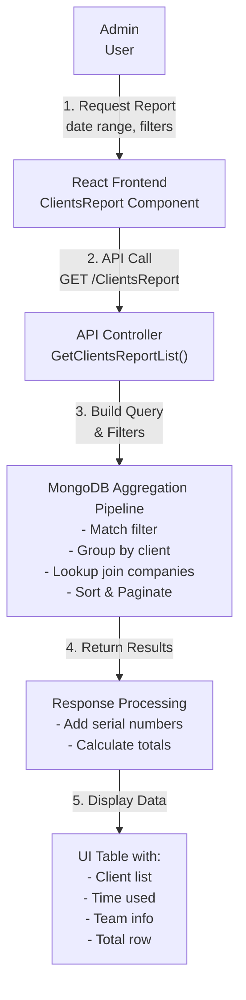
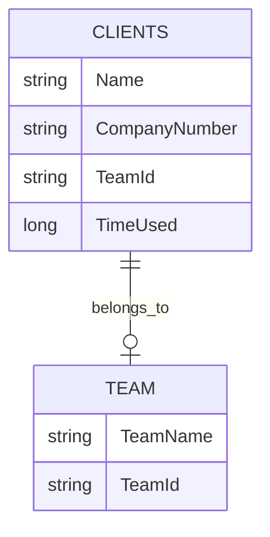

# Overview

The **Client Report** API and frontend component provide a mechanism to generate detailed reports about clients based on various parameters, including team, date range, and time usage. The backend aggregates data about clients' time usage across various projects, and the frontend displays this data in a user-friendly table with features such as sorting, filtering, and pagination. 

The API call `/clientsreport` returns a paginated list of clients filtered by specific parameters such as date range and team ID. It also provides the total time used and other related metrics for the filtered clients. On the frontend, this data is presented in a table, and the user can interact with it to view more details, such as sorting and filtering by different columns.

### Key Features
- Filter reports by date range (from/to dates)
- Sort by multiple columns (client name, time used, team)
- View detailed time usage per client
- Filter by team
- Display company details including business name and company number
- Drill-down capability to view detailed page view records

# DFD (Data Flow Diagram)

# Process Flow

1. **User Interaction**: The user selects a team and a date range from the frontend interface.
2. **Request to API**: The frontend sends a request with the selected filters (team ID, date range, etc.) to the backend API.
3. **Backend Processing**: The backend API validates the filters, queries the database, aggregates the time data, and prepares the response.
4. **Data Aggregation**: The data is aggregated (total time used by each client) based on the filters and returned to the frontend.
5. **Frontend Display**: The frontend receives the paginated data and displays it to the user in a table format.

# ER Diagram

# Entity Definition

- **Client**:
  - `Name`: The name of the client.
  - `CompanyNumber`: The unique company number assigned to the client.
  - `TeamId`: The team associated with the client.
  - `TimeUsed`: The total time used by the client on projects.

- **Team**:
  - `TeamName`: The name of the team.
  - `TeamId`: The unique identifier for the team.

# Authentication / APIs

### Authentication
The **Team Report** endpoint requires an **ADMIN** or **MANAGER** role to access. The backend is protected using role-based access control (RBAC) with the `[Authorize]` attribute.

### API Endpoints

| **Description**                   | **HTTP Method**   | **Endpoint**                                                                 |
|-----------------------------------|-------------------|-----------------------------------------------------------------------------|
| **Get Clients Report**     | GET               | [/clientsreport](https://apiuat.actingoffice.com/api-docs/index.html?urls.primaryName=Acting+Office+-+CRM) |

# Testing Guide

1. **Unit Testing**:
   - Use tools like Jest to test individual components like API request handlers and response aggregations.
   - Mock database calls to ensure that data retrieval and processing logic is correct.

2. **Integration Testing**:
   - Test the entire flow from frontend input to API response and frontend display.
   - Ensure that sorting, filtering, and pagination work as expected.

3. **UI Testing**:
   - Use tools like Cypress to automate UI testing and ensure the table displays the data correctly.
   - Test edge cases such as no data, invalid filters, and large datasets.

# References

- **API Documentation**: [Link to email service API documentation].
