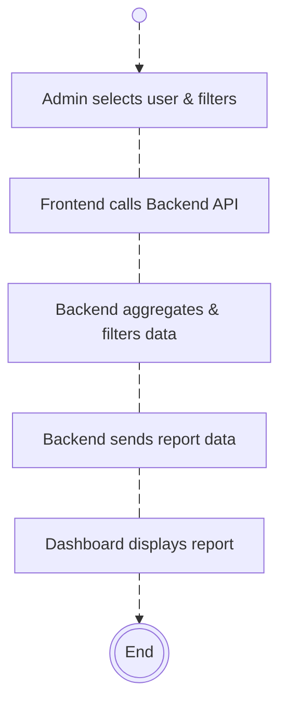
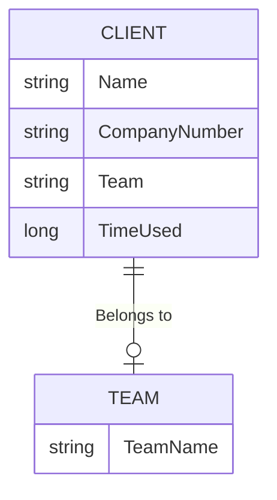

# Clients Report Documentation

## Overview

The **Clients Report** feature allows Admin and Managers to access detailed reports about clients. This report includes vital information like the client name, company number, team association, and the time spent on client-related activities. The feature supports filtering by date range, team, and sorting by various parameters. It provides data in a paginated format to help manage large datasets efficiently.

The Clients Report integrates with both the frontend (React-based) and backend (ASP.NET Core Web API) to ensure seamless data retrieval and display. Admins can filter, sort, and view detailed reports with ease, making it an essential tool for managing client-related performance metrics.

## DFD (Data Flow Diagram)



## Process Flow

1. **Start**: The process begins when the Admin/Manager initiates the flow.
2. **Admin Selects User & Filters**: The Admin/Manager selects the user and applies necessary filters like date range, team, and sorting parameters.
3. **Frontend Calls Backend API**: The frontend sends an API request to fetch data based on selected filters.
4. **Backend Aggregates & Filters Data**: The backend processes the data and applies necessary aggregations and filters.
5. **Backend Sends Report Data**: The backend sends the aggregated report data back to the frontend.
6. **Dashboard Displays Report**: The frontend displays the report on the dashboard.
7. **End**: The process ends once the report is displayed.

## ER Diagram



## Entity Definitions

### Client

- **Name**: The name of the client.
- **CompanyNumber**: The unique company number assigned to the client.
- **Team**: The team to which the client belongs.
- **TimeUsed**: The total time spent on activities related to the client.

### Team

- **TeamName**: The name of the team managing the clients.

## Authentication / APIs

### Frontend API Call: `getClientsReport`

```typescript
getClientsReport = (params: { start: number; length: number; search?: string; sortCol?: string; sortDir?: string; fromDate?: string; toDate?: string; teamId?: string }) =>
    ApiUtility.getResult<IApiListResultWithTotal<IPageViewClientsReportResponseItem, IPageViewClientsReportResponseItem>>(`${this.route}/clientsreport`, params);
```

#### Backend API Route: `GetClientsReportList`

```csharp
[HttpGet("ClientsReport")]
[Authorize(Roles = "ADMIN")]
public async Task<ApiResponse<PagedData<PageViewsClientsReportResponseItem, PageViewsClientsReportResponseItem>>> GetClientsReportList(string fromDate, string toDate, int start = 0, int length = 15, string sortCol = null, string sortDir = null, string teamId = null)
```

- **Route**: `/clientsreport`
- **Method**: `GET`
- **Description**: Fetches the client report data, including filtering by date, team, and sorting by column.

#### Request Parameters:

- **start**: The starting index for pagination (default: 0)
- **length**: The number of records per page (default: 15)
- **fromDate**: The start date for filtering the report.
- **toDate**: The end date for filtering the report.
- **sortCol**: The column to sort by (optional).
- **sortDir**: The direction of sorting (`asc` or `desc`).
- **teamId**: The ID of the team to filter clients.

#### Response:

Returns a paginated list of clients with time usage, and total records.

## Testing Guide

To test the **Clients Report** feature, follow these steps:

1. **Set up the environment**: Ensure the backend is running and the frontend is properly connected to the backend API.
2. **API Test**: Use Postman or a similar API testing tool to test the `GET /clientsreport` endpoint. Test with different combinations of the `fromDate`, `toDate`, `teamId`, and sorting parameters.
3. **Frontend Test**: Use the **ClientsReport** React component to view the report. Test various date ranges, search functionality, and sorting features. Ensure that data is correctly filtered and displayed.
4. **Edge Cases**: Test the API and frontend with invalid or missing parameters. Ensure proper error handling and feedback are displayed.

## References

- **Frontend API Integration**: `getClientsReport` method from the `ClientsReport.tsx` file.
- **Backend API Documentation**: `GetClientsReportList` from the backend controller.
- **Entity Models**: `PageViewsClientsReportResponseItem` and `Team` model definitions.

