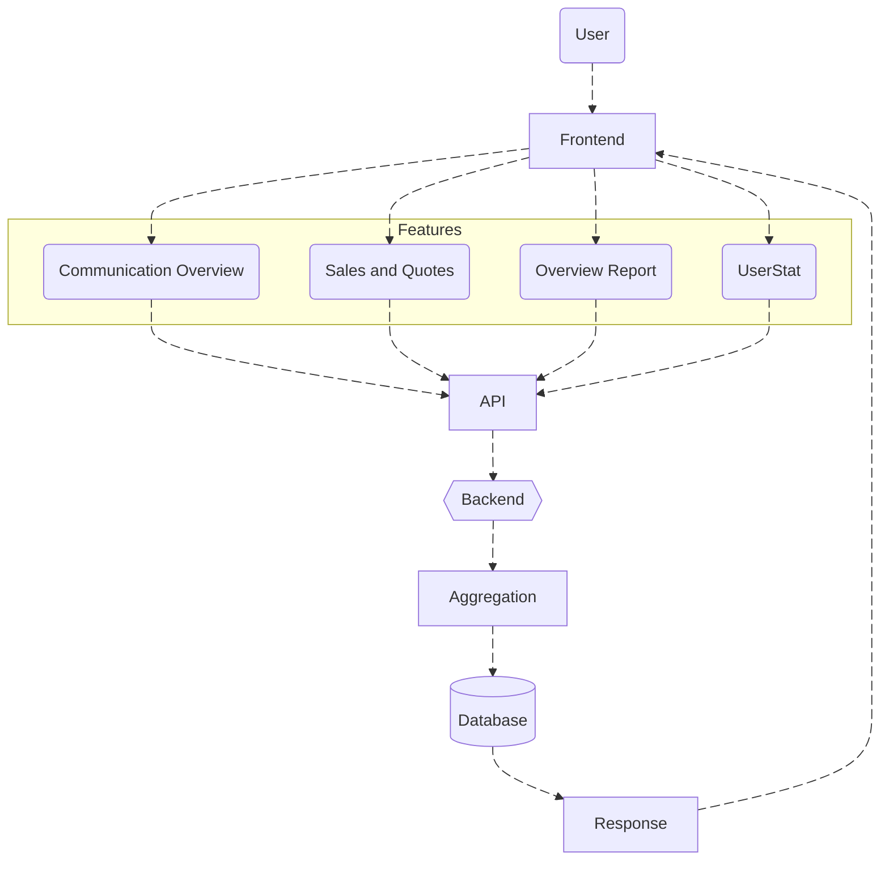
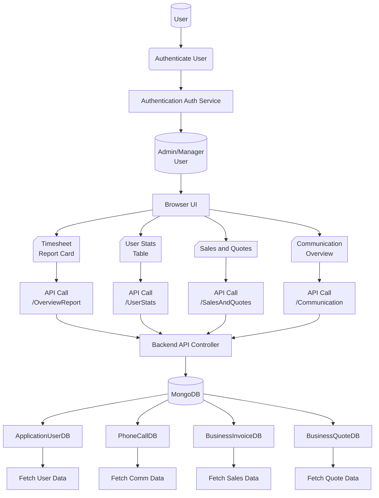
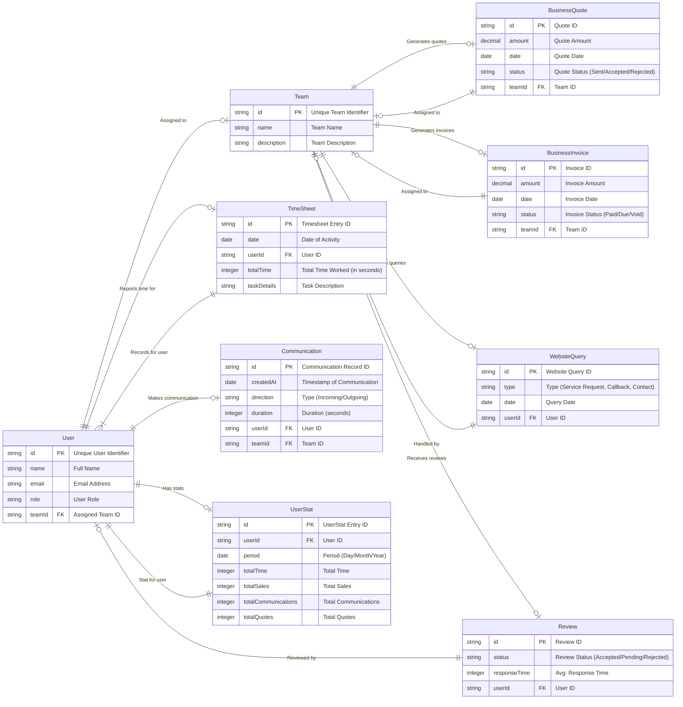

# Timesheet Dashboard Overview

The **Timesheet Dashboard** provides an administrative interface for monitoring and analyzing employee activities, communications, sales, and other key metrics. It consolidates various reports, offers comprehensive insights, and displays statistics in an easy-to-read format, making it an essential tool for managers and admins. 

## Components

The dashboard is divided into the following primary components:

1. **Lead Report**: Provides insights into the number of leads, lead conversions, and lost leads.
2. **Call Report**: Displays the total number of calls, the number of incoming and outgoing calls, and the total call duration.
3. **Email Report**: Shows the total number of emails, including inbox, sent, and draft emails.
4. **Website Queries Report**: Tracks website queries, including callback requests, contact queries, and service requests.

## Sections

The dashboard is organized into various sections for optimal user experience:

### 1. **Top-Level Overview**
This section includes summary cards for quick insights into leads, calls, emails, and website queries. Each card provides an aggregate count along with detailed breakdowns (e.g., leads converted, lead lost, incoming/outgoing calls, etc.).

### 2. **Detailed Reports**
This section allows users to filter data by dates and teams. The available filters allow users to choose different time periods, such as "This Month," "Last Month," "This Year," and even custom date ranges. It also includes a dropdown to select the team, allowing users to narrow the data to specific teams within the organization.

#### Filters:
- **Team Filter**: Allows selecting the team to view specific reports.
- **Date Range Picker**: Users can select a custom date range or use predefined ranges (e.g., "This Month," "Last Week").

### 3. **User Report Table**
This table displays a list of top and bottom users based on their activity. It includes columns for:
- **User Name**: The name of the employee.
- **Team**: The team the user belongs to.
- **Total Hours Worked**: The total amount of time worked by the user within the selected date range.
- **Average Hours**: Whether the user worked above average time during the selected period.

### 4. **Sales and Quotes Report**
This section displays sales and quotes data:
- **Sales**: Displays the total sales, total receipts, and pending sales.
- **Quotes**: Displays the number of accepted, pending, and raised quotes, along with the total value of these quotes.

### 5. **Communication Overview**
This section provides insights into communication activity within the organization, tracking incoming and outgoing calls. It also includes a breakdown of calls by day, week, month, or year, depending on the user's selected period.


## DFD

### Level 0 Data Flow Diagram



---

## Process Flow



##  ER Diagram



---


## Entity Definitions for Timesheet Dashboard System

## 1. **User**
- **id** (PK): Unique User Identifier
- **name**: Full Name
- **email**: Email Address
- **role**: User Role
- **teamId** (FK): Assigned Team ID

## 2. **Team**
- **id** (PK): Unique Team Identifier
- **name**: Team Name
- **description**: Team Description

## 3. **TimeSheet**
- **id** (PK): Timesheet Entry ID
- **date**: Date of Activity
- **userId** (FK): User ID
- **totalTime**: Total Time Worked (in seconds)
- **taskDetails**: Task Description

## 4. **Communication**
- **id** (PK): Communication Record ID
- **createdAt**: Timestamp of Communication
- **direction**: Type (Incoming/Outgoing)
- **duration**: Duration (seconds)
- **userId** (FK): User ID
- **teamId** (FK): Team ID

## 5. **BusinessQuote**
- **id** (PK): Quote ID
- **amount**: Quote Amount
- **date**: Quote Date
- **status**: Quote Status (Sent/Accepted/Rejected)
- **teamId** (FK): Team ID

## 6. **BusinessInvoice**
- **id** (PK): Invoice ID
- **amount**: Invoice Amount
- **date**: Invoice Date
- **status**: Invoice Status (Paid/Due/Void)
- **teamId** (FK): Team ID

## 7. **WebsiteQuery**
- **id** (PK): Website Query ID
- **type**: Type (Service Request, Callback, Contact)
- **date**: Query Date
- **userId** (FK): User ID

## 8. **Review**
- **id** (PK): Review ID
- **status**: Review Status (Accepted/Pending/Rejected)
- **responseTime**: Avg. Response Time
- **userId** (FK): User ID

## Relationships
- **User** is assigned to **Team**
- **User** reports **TimeSheet**
- **User** makes **Communication**
- **Team** generates **BusinessQuote**
- **Team** generates **BusinessInvoice**
- **Team** handles **WebsiteQuery**
- **Team** receives **Review**


---

# Authentication/API Endpoints

This section outlines the API routes and authentication used in the Timesheet Dashboard.

## 1. **Authentication**
- Most endpoints infer **PracticeId** from the authenticated user context (`User.GetPracticeId()`).
- `UserReport` is explicitly protected: `[Authorize(Roles = "ADMIN")]`.
- `TeamReport` allows `[Authorize(Roles = "ADMIN,MANAGER")]`.
.

# API Endpoints Documentation

## **API Endpoints:**

| **Description**                    | **HTTP Method**               | **Endpoint**                                                                 |
|------------------------------------|-------------------------------|-----------------------------------------------------------------------------|
| **Get Dashboard User Stats**       | GET                           | [/UserStats](https://apiuat.actingoffice.com/api-docs/index.html?urls.primaryName=Acting+Office+-+CRM) |
| **Get Overview Report**            | GET                           | [/OverviewReport](https://apiuat.actingoffice.com/api-docs/index.html?urls.primaryName=Acting+Office+-+CRM) |
| **Get Phone Calls Overview**       | GET                           | [/Communication](https://apiuat.actingoffice.com/api-docs/index.html?urls.primaryName=Acting+Office+-+CRM) |
| **Get Quotes and Sales Report**    | GET                           | [/QuotesSales](https://apiuat.actingoffice.com/api-docs/index.html?urls.primaryName=Acting+Office+-+CRM) |


---

This concludes the **Authentication/API Endpoints** documentation for the Timesheet Dashboard. All API routes are protected and require valid authentication for access.


## Testing Guide for Timesheet Dashboard

### **Unit Testing**

1. **Test User Stats Calculation**  
   - **Objective**: Ensure that user statistics, such as total time worked, are calculated correctly.
   - **Test Cases**:  
     - Test that the `TotalTime` is calculated correctly for each user by aggregating their module activity.
     - Verify that users with less than 60 minutes of total time are excluded from the results.

2. **Test Time Conversion**  
   - **Objective**: Ensure that time formatting functions, such as converting seconds to hours, minutes, and seconds, are working correctly.
   - **Test Cases**:  
     - Verify that the `getTimeHours` function converts seconds into a correctly formatted string (e.g., `5h 30m 20s`).

3. **Test Frontend Components Rendering**  
   - **Objective**: Test rendering of frontend components such as cards and tables.
   - **Test Cases**:  
     - Ensure that `TimeSheetUserTable` renders user data properly including name, team, total time, and average time.
     - Validate the correct display of cards for **Leads**, **Calls**, **Emails**, and **Website Queries** in the `NewAdminTimeSheet` component.

4. **Test Sorting Logic**  
   - **Objective**: Ensure sorting functionality for timesheet data works correctly.
   - **Test Cases**:  
     - Verify that sorting by `TotalTime` works in ascending and descending order.
     - Check that the **Top 10** and **Bottom 10** users are displayed correctly based on sorting order.

### **Integration Testing**

1. **Test Backend Communication for Dashboard Stats**  
   - **Objective**: Ensure proper communication between frontend and backend for fetching user stats, sales data, and communication data.
   - **Test Cases**:  
     - Validate the `GetDashboardUserStats` API by testing the response structure and correctness.
     - Test the `OverviewReport` API to ensure it returns valid **Sales**, **Quotes**, and **Communication** data.
     - Verify that the `GetPhoneCalls` endpoint correctly returns incoming and outgoing call statistics for the specified team and date range.

2. **Test Date Filtering Logic**  
   - **Objective**: Test that the date filters (`fromDate`, `toDate`) work as expected.
   - **Test Cases**:  
     - Apply a date range and verify that data is correctly filtered for **Sales**, **Quotes**, and **Communication**.
     - Test that the date filtering logic is properly handled on the backend for both **teamId** and **date range**.

3. **Test User Timesheet API**  
   - **Objective**: Ensure that the `OverviewReport` endpoint returns valid data for **Lead**, **Call**, and **Web Query** reports.
   - **Test Cases**:  
     - Validate that the `LeadReportResponse`, `CallReportResponse`, `WebQueriesResponse` in the API response match expected formats.

### **End-to-End Testing**

1. **Full Dashboard Flow**  
   - **Objective**: Test the full flow from fetching user stats to displaying them in the UI.
   - **Test Cases**:  
     - Fetch user data from the `GetDashboardUserStats` API and check that it is rendered correctly in the `TimeSheetUserTable`.
     - Ensure that the **Leads**, **Calls**, **Emails**, and **Website Queries** cards are rendered with the correct data in `NewAdminTimeSheet`.

2. **Sales and Quotes Data Flow**  
   - **Objective**: Test the integration of **Sales** and **Quotes** reporting from backend to frontend.
   - **Test Cases**:  
     - Ensure the `SalesCard` component correctly displays the total sales, receipts, and pending data.
     - Test the `QuotesCard` component for displaying quotes data (accepted, sent, pending).

3. **Test Communication Data Flow**  
   - **Objective**: Validate the fetching, processing, and rendering of communication data such as phone calls.
   - **Test Cases**:  
     - Ensure that the `CommunicationOverview` component accurately reflects call data (incoming, outgoing) for the selected date range.
     - Verify that the `ReviewsCard` displays review statistics (total reviews, accepted, pending, rejected) correctly.

### **Mock Data for Testing**

- **Mock Call Data for Communication Overview**  
  For testing `CommunicationOverview` component:
  ```javascript
  const mockData = [
    { key: 'Jan 2024', incoming: 200, outgoing: 150 },
    { key: 'Feb 2024', incoming: 180, outgoing: 130 },
    { key: 'Mar 2024', incoming: 220, outgoing: 180 }
  ];

---

##  References

### Frontend modules (uploaded)
- Dashboard container: `NewAdminTimeSheet.tsx` 
- Communication + Reviews cards: `NewCommunicationReviewsCardComponent.tsx`   
- Sales + Quotes cards: `NewSalesQuotesCardComponent.tsx` 
- Top/Bottom user table: `NewTimeSheetUserTable.tsx` 

### Notes
- The dashboard triggers API calls via `useEffect` based on dependencies like `fromDate`, `toDate`, `refresh`, and `teamId`. 
- Sales/Quotes depend on `ReportService.getQuotesAndSalesReport(...)` and render ECharts charts. 


