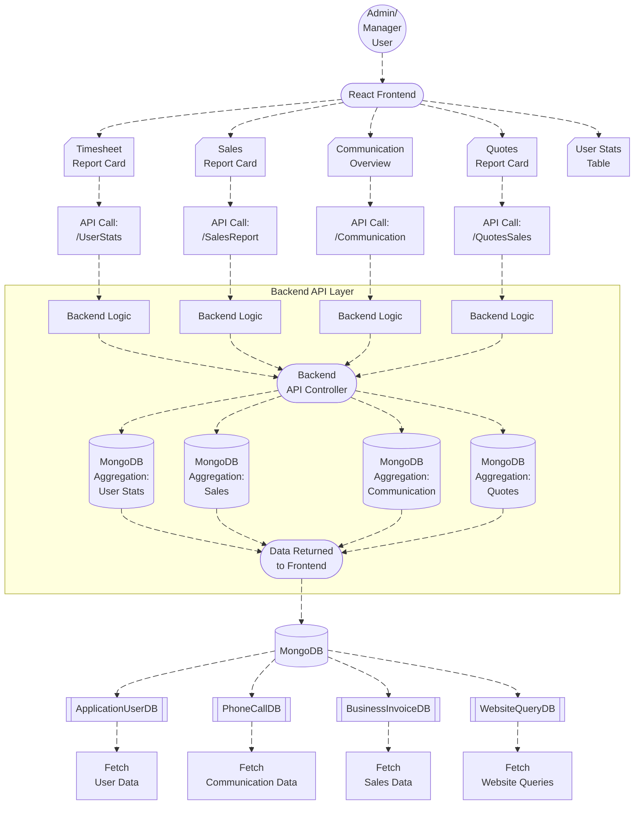

# Timesheet Dashboard Overview

The **Timesheet Dashboard** provides an administrative interface for monitoring and analyzing employee activities, communications, sales, and other key metrics. It consolidates various reports, offers comprehensive insights, and displays statistics in an easy-to-read format, making it an essential tool for managers and admins. 

## Components

The dashboard is divided into the following primary components:

1. **Lead Report**: Provides insights into the number of leads, lead conversions, and lost leads.
2. **Call Report**: Displays the total number of calls, the number of incoming and outgoing calls, and the total call duration.
3. **Email Report**: Shows the total number of emails, including inbox, sent, and draft emails.
4. **Website Queries Report**: Tracks website queries, including callback requests, contact queries, and service requests.

## Sections

The dashboard is organized into various sections for optimal user experience:

### 1. **Top-Level Overview**
This section includes summary cards for quick insights into leads, calls, emails, and website queries. Each card provides an aggregate count along with detailed breakdowns (e.g., leads converted, lead lost, incoming/outgoing calls, etc.).

### 2. **Detailed Reports**
This section allows users to filter data by dates and teams. The available filters allow users to choose different time periods, such as "This Month," "Last Month," "This Year," and even custom date ranges. It also includes a dropdown to select the team, allowing users to narrow the data to specific teams within the organization.

#### Filters:
- **Team Filter**: Allows selecting the team to view specific reports.
- **Date Range Picker**: Users can select a custom date range or use predefined ranges (e.g., "This Month," "Last Week").

### 3. **User Report Table**
This table displays a list of top and bottom users based on their activity. It includes columns for:
- **User Name**: The name of the employee.
- **Team**: The team the user belongs to.
- **Total Hours Worked**: The total amount of time worked by the user within the selected date range.
- **Average Hours**: Whether the user worked above average time during the selected period.

### 4. **Sales and Quotes Report**
This section displays sales and quotes data:
- **Sales**: Displays the total sales, total receipts, and pending sales.
- **Quotes**: Displays the number of accepted, pending, and raised quotes, along with the total value of these quotes.

### 5. **Communication Overview**
This section provides insights into communication activity within the organization, tracking incoming and outgoing calls. It also includes a breakdown of calls by day, week, month, or year, depending on the user's selected period.


## DFD

### Level 0 Data Flow Diagram



---

## Process Flow


##  ER Diagram


---


## Entity Definitions for Timesheet Dashboard System

## 1. **User**
Represents the users in the system, including both admin/manager and regular users.

### Fields:
- **id**: `string` - Unique User Identifier
- **name**: `string` - Full Name of the User
- **email**: `string` - Email Address
- **role**: `string` - User's Role (e.g., Admin, Manager, User)
- **teamId**: `string` - ID of the Team the User is Assigned To

---

## 2. **Team**
Represents the teams within the organization. Teams handle tasks and assign users to different activities.

### Fields:
- **id**: `string` - Unique Team Identifier
- **name**: `string` - Team Name
- **description**: `string` - Description of the Team and its purpose

---

## 3. **TimeSheet**
Represents the timesheet entry for a user, including the total time worked on specific tasks.

### Fields:
- **id**: `string` - Unique Timesheet Entry ID
- **date**: `date` - Date of the Activity or Work Logged
- **userId**: `string` - User ID (Foreign Key) - The user submitting the timesheet
- **totalTime**: `integer` - Total Time Worked (in seconds)
- **taskDetails**: `string` - Description of the task or activity performed

---

## 4. **Communication**
Represents the communication records (incoming or outgoing) related to a user and their team.

### Fields:
- **id**: `string` - Unique Communication Record ID
- **createdAt**: `date` - Timestamp when the communication occurred
- **direction**: `string` - Direction of the Communication (e.g., "Incoming" or "Outgoing")
- **duration**: `integer` - Duration of the Communication in seconds
- **userId**: `string` - User ID (Foreign Key) - The user who made or received the communication
- **teamId**: `string` - Team ID (Foreign Key) - The team handling the communication

---

## 5. **BusinessQuote**
Represents the business quotes generated by the team for potential clients.

### Fields:
- **id**: `string` - Unique Quote ID
- **amount**: `decimal` - The amount of the quote
- **date**: `date` - The date the quote was created
- **status**: `string` - The status of the quote (e.g., "Sent", "Accepted", "Rejected")
- **teamId**: `string` - Team ID (Foreign Key) - The team generating the quote

---

## 6. **BusinessInvoice**
Represents the invoices generated by the team for completed work or services.

### Fields:
- **id**: `string` - Unique Invoice ID
- **amount**: `decimal` - The total amount of the invoice
- **date**: `date` - The date the invoice was generated
- **status**: `string` - The status of the invoice (e.g., "Paid", "Due", "Void")
- **teamId**: `string` - Team ID (Foreign Key) - The team generating the invoice

---

## 7. **WebsiteQuery**
Represents the queries submitted by users through the website, such as service requests or callback requests.

### Fields:
- **id**: `string` - Unique Website Query ID
- **type**: `string` - The type of query (e.g., "Service Request", "Callback", "Contact")
- **date**: `date` - The date the query was submitted
- **userId**: `string` - User ID (Foreign Key) - The user who submitted the query

---

## 8. **Review**
Represents the reviews or feedback associated with users and their tasks or performances.

### Fields:
- **id**: `string` - Unique Review ID
- **status**: `string` - The status of the review (e.g., "Accepted", "Pending", "Rejected")
- **responseTime**: `integer` - Average response time for the review (in seconds)
- **userId**: `string` - User ID (Foreign Key) - The user who received the review

---

## Relationships:

- **User to Team**: A `User` is assigned to a `Team`. A `Team` can have multiple users.
- **User to TimeSheet**: A `User` can submit multiple `TimeSheet` entries. Each `TimeSheet` belongs to one user.
- **User to Communication**: A `User` can have multiple communication records, each tied to a specific team and direction (incoming or outgoing).
- **Team to BusinessQuote**: A `Team` can generate multiple `BusinessQuote` records. Each `BusinessQuote` is associated with one team.
- **Team to BusinessInvoice**: A `Team` can generate multiple `BusinessInvoice` records. Each `BusinessInvoice` belongs to one team.
- **Team to WebsiteQuery**: A `Team` handles multiple `WebsiteQuery` records. Each `WebsiteQuery` is associated with a specific team.
- **Team to Review**: A `Team` can have multiple `Review` records. Each `Review` is associated with one team.
- **TimeSheet to User**: Each `TimeSheet` entry is associated with a `User`, indicating which user logged the hours.
- **BusinessQuote to Team**: Each `BusinessQuote` record is linked to a specific `Team`.
- **BusinessInvoice to Team**: Each `BusinessInvoice` record is linked to a specific `Team`.
- **WebsiteQuery to Team**: Each `WebsiteQuery` record is linked to a specific `Team`.
- **Review to User**: Each `Review` record is linked to a specific `User`.

---

This structure should provide a clear and organized view of the entities involved in the Timesheet Dashboard system, including their relationships and attributes.

---

# Authentication/API Endpoints

This section outlines the API routes and authentication used in the Timesheet Dashboard.

## 1. **Authentication**
Authentication is required for accessing the APIs. Users must be authenticated to access the timesheet and report data.

## 2. **API Routes**

### 2.1 **User Stats**
- **Route**: `/UserStats`
- **Method**: `GET`
- **Description**: Fetches user statistics such as total time worked, average time, and teams.
- **Query Parameters**:
  - `fromDate`: Start date (optional)
  - `toDate`: End date (optional)
  - `teamId`: Team ID (optional)
  - `sortDir`: Sorting direction (optional, `asc` or `desc`)

### 2.2 **Communication Overview**
- **Route**: `/Communication`
- **Method**: `GET`
- **Description**: Fetches an overview of communication activity, including total calls, incoming and outgoing calls.
- **Query Parameters**:
  - `fromDate`: Start date (optional)
  - `toDate`: End date (optional)
  - `teamId`: Team ID (optional)

### 2.3 **Timesheet Overview Report**
- **Route**: `/OverviewReport`
- **Method**: `GET`
- **Description**: Fetches the timesheet overview report, including data about leads, calls, emails, and sales.
- **Query Parameters**:
  - `teamId`: Team ID (optional)
  - `fromDate`: Start date (optional)
  - `toDate`: End date (optional)

### 2.4 **Quotes and Sales Report**
- **Route**: `/QuotesSales`
- **Method**: `GET`
- **Description**: Fetches a report of quotes and sales data, including the total amount of sales, quotes, and pending quotes.
- **Query Parameters**:
  - `fromDate`: Start date (optional)
  - `toDate`: End date (optional)
  - `teamId`: Team ID (optional)

## 3. **Database Interactions**

The backend interacts with the following databases to retrieve and aggregate the data for these endpoints:
- **MongoDB**:
  - **ApplicationUserDB**: Stores user information including name, teams, and roles.
  - **PhoneCallDB**: Stores phone call records including call duration and direction.
  - **BusinessInvoiceDB**: Stores sales and invoice details.
  - **BusinessQuoteDB**: Stores quotes and their statuses (sent, accepted, pending).
  
These databases are queried using MongoDB’s aggregation framework to provide the necessary insights.

## 4. **Summary of Endpoints**

| Endpoint Route        | HTTP Method | Description                                     |
|-----------------------|-------------|-------------------------------------------------|
| `/UserStats`          | `GET`       | Fetch user statistics (e.g., total time worked) |
| `/Communication`      | `GET`       | Fetch communication overview (calls data)      |
| `/OverviewReport`     | `GET`       | Fetch timesheet overview report                |
| `/QuotesSales`        | `GET`       | Fetch quotes and sales report                  |

These endpoints are used to gather and display data for the Timesheet Dashboard. All of them support query parameters for filtering and sorting the data.

---

This concludes the **Authentication/API Endpoints** documentation for the Timesheet Dashboard. All API routes are protected and require valid authentication for access.


## Testing Guide

### Quick smoke tests (curl)

> Replace `BASE_URL` and token, and use the date format your API expects.

```bash
export BASE_URL="https://apidev.example.com/Timesheet"
export TOKEN="YOUR_JWT"

curl -s "$BASE_URL/OverviewReport?fromDate=01/12/2025&toDate=31/12/2025&teamId=" \
  -H "Authorization: Bearer $TOKEN" | jq

curl -s "$BASE_URL/QuotesSales?fromDate=01/12/2025&toDate=31/12/2025&teamId=" \
  -H "Authorization: Bearer $TOKEN" | jq

curl -s "$BASE_URL/Communication?fromDate=01/12/2025&toDate=31/12/2025&teamId=" \
  -H "Authorization: Bearer $TOKEN" | jq

curl -s "$BASE_URL/UserStats?fromDate=01/12/2025&toDate=31/12/2025&teamId=&sortDir=desc" \
  -H "Authorization: Bearer $TOKEN" | jq
```

### Functional test checklist
- Date range filter returns stable bucket sequences (no missing labels).
- Team filter scopes results consistently across all cards.
- Switching date/team should not cause redundant double-fetches on the same component (watch network tab).
- Validate weekend exclusion behavior in `UserReport` and `TeamReport`.
- Verify role-gated endpoints return **403** for non-admin/non-manager accounts.

---

##  References

### Frontend modules (uploaded)
- Dashboard container: `NewAdminTimeSheet.tsx` 
- Communication + Reviews cards: `NewCommunicationReviewsCardComponent.tsx`   
- Sales + Quotes cards: `NewSalesQuotesCardComponent.tsx` 
- Top/Bottom user table: `NewTimeSheetUserTable.tsx` 

### Notes
- The dashboard triggers API calls via `useEffect` based on dependencies like `fromDate`, `toDate`, `refresh`, and `teamId`. 
- Sales/Quotes depend on `ReportService.getQuotesAndSalesReport(...)` and render ECharts charts. 


