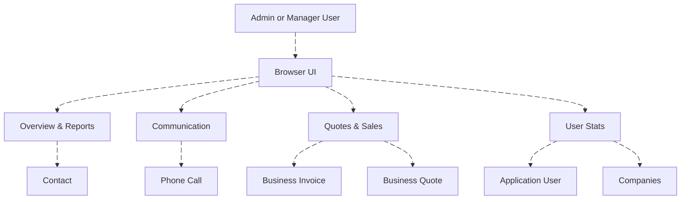
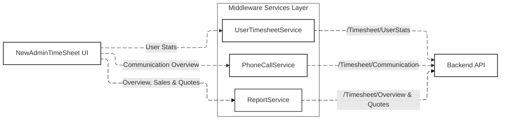
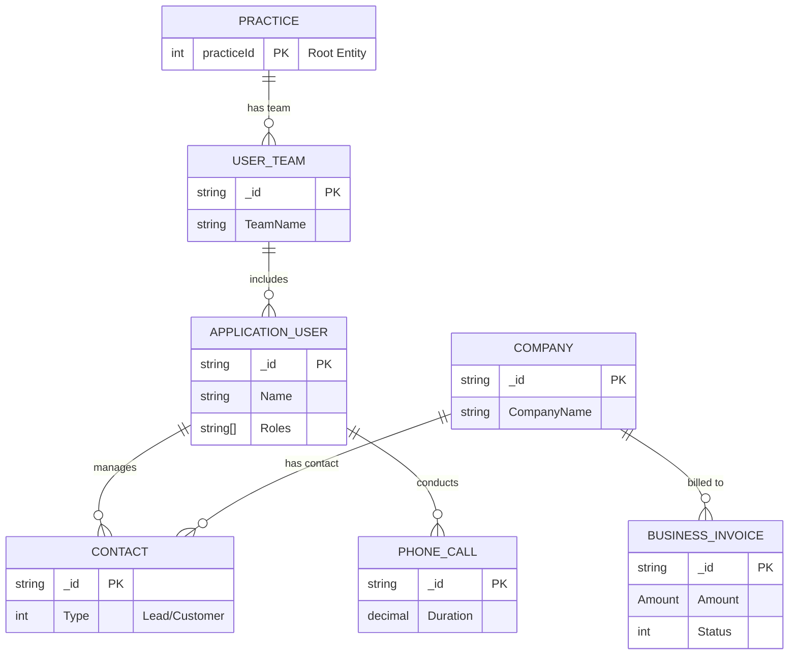

# Timesheet Dashboard API & Frontend Module Documentation

## Overview

The **Timesheet Dashboard** is an Admin/Manager reporting tool that aggregates **user activity time**, **communications**, **leads**, **website queries**, and **quotes/sales** into a single dashboard UI.

This dashboard serves as a comprehensive reporting solution, displaying real-time data visualizations and detailed reports, allowing administrators and managers to view various key performance indicators (KPIs). The frontend and backend work together to provide seamless access to the data.

### Key Features:
- **Backend reporting endpoints** (MongoDB aggregations) compute overview KPIs and breakdowns.
- **Frontend dashboard components** render cards, charts, and tables such as the "Top 10 / Bottom 10" user stats.
- **UI-driven filters** for date ranges, teams, and other criteria.

### Main Components:
1. **Backend Services**:
   - **ReportService**: Handles the fetching and aggregation of data such as timesheets, communications, and sales.
   - **PhoneCallService**: Manages the fetching of communication data, including calls and reviews.
   - **TimesheetService**: Handles the querying and filtering of timesheet data.
   - **Sales/Quotes Service**: Aggregates sales and quotes data, including receipts and pending amounts.

2. **Frontend Components**:
   - **NewAdminTimeSheet**: Main container for the dashboard, managing data requests and passing them to child components.
   - **Cards**: Displays key metrics like leads, calls, emails, and website queries.
   - **Charts**: Visualizations for sales and communications.
   - **User Stats**: Tables showing the top and bottom user performers based on time worked, calls made, etc.

## DFD

### Level 0 Data Flow Diagram



---

## Process Flow



##  ER Diagram

> **Movable/zoomable note:** Mermaid diagrams can be panned/zoomed in many Markdown viewers (GitHub, Mermaid Live, VSCode extensions). If your viewer is static, open the `.md` in a Mermaid-enabled renderer for drag/zoom.



---

## Entity Definition

### Response / DTO models used by the dashboard

#### `TimeSheetReport`
Aggregated overview KPIs for the top cards.
- `LeadReport` (`LeadReportResponse`): leads, converted, lost
- `CallReport` (`CallReportResponse`): calls, incoming, outgoing, duration
- `WebQueries` (`WebQueriesResponse`): total and by query type
- `TimesheetMails` (`TimesheetMailResponse`): email counts (currently returned as zeros in the shown implementation)

#### `CommunicationOverviewResponse`
- `CallsOverview` (`ComunicationCallResponse`): totals + time-bucketed incoming/outgoing series
- `ReviewsOverview` (`ReviewsOverview`): placeholder object currently initialized with zeros in the shown backend code

#### `TSDashBoardUserStats`
User-level “Top/Bottom” list item
- `Name` (concatenated first + last)
- `Teams` (`ApplicationUserTeamDetail[]`)
- `TotalTime` (seconds)
- `Average` (computed “above average” indicator value)

#### `TeamMemberReport` / `TeamMemberReportSummary`
Team rollup report:
- `TotalTime` = fixed capacity (8h 30m per working day × number of working days)
- `TimeUsed` = aggregated active seconds
- `TimeAvailable` = max(0, capacity - used)
- `TeamEfficiency` = used% capped at 100

---

## Authentication / APIs

### Authentication
All endpoints are protected by your API’s authentication middleware. Some endpoints have explicit role requirements:
- `UserReport` requires **ADMIN** role.
- `TeamReport` requires **ADMIN** or **MANAGER**.

Use a JWT token:

```http
Authorization: Bearer <jwt_token>
Content-Type: application/json
```

### Base URL
```txt
https://<your-domain>/<controller-base>
```

### Endpoints

#### 1) Dashboard User Stats (Top/Bottom list)
```http
GET /Timesheet/UserStats?fromDate=DD/MM/YYYY&toDate=DD/MM/YYYY&teamId=<id>&sortDir=asc|desc
```

**Notes**
- Filters users by practice, excludes certain statuses/roles, excludes `Config.EFR == true`.
- Aggregates `UserDashboardData.Date` between from/to and sums `ModuleActivity.Total`.
- Removes users with `TotalTime < 60` seconds.
- Computes `Average` using `GetAvereage(totalTime, averageTime)`.

#### 2) PageViews User Report (user-wise client report)
```http
GET /Timesheet/UserReport?userId=<id>&start=0&length=15&sortCol=Name&sortDir=asc&fromDate=dd/MM/yyyy&toDate=dd/MM/yyyy&isWeekendIncluded=false
```

**Notes**
- Aggregates `UserSessionPageView` per `CompanyId`
- If weekends excluded, adds a `$dayOfWeek` field and filters out 1 (Sunday) and 7 (Saturday)
- Looks up `Companies` to attach `Name` and `CompanyNumber`

#### 3) Communication Overview (Calls chart + Reviews summary)
```http
GET /Timesheet/Communication?fromDate=dd/MM/yyyy&toDate=dd/MM/yyyy&teamId=<optional>
```

**Notes**
- Groups calls by `Direction` for totals.
- Chooses a dynamic “bucket strategy” based on date span: weekday vs date vs month.
- Returns an ordered bucket list with missing buckets filled (`EnsureContinuous`).
- Frontend renders it as a bar chart. fileciteturn0file1L148-L173

#### 4) Overview Report (Leads, Calls, Web Queries, Emails)
```http
GET /Timesheet/OverviewReport?teamId=<optional>&fromDate=dd/MM/yyyy&toDate=dd/MM/yyyy
```

**Notes**
- Runs three aggregates in parallel: Contacts, PhoneCalls, WebsiteQueries.
- Builds `TimeSheetReport` from grouped results.
- Email stats currently returned as zeros in the shown backend snippet.

#### 5) Quotes & Sales Report
```http
GET /Timesheet/QuotesSales?fromDate=dd/MM/yyyy&toDate=dd/MM/yyyy&teamId=<optional>
```

**Notes**
- Sales: filters invoices (non-void) and builds time-series buckets for receipts vs pending
- Quotes: groups quotes by status to compute `sentQuotes`, `acceptedQuotes`, `pendingQuotes`
- Frontend renders Sales as stacked bars and Quotes as donut chart. fileciteturn0file2L214-L276

#### 6) Team Report
```http
GET /Timesheet/{teamId}/TeamReport?fromDate=dd/MM/yyyy&toDate=dd/MM/yyyy&isWeekendIncluded=false
```

**Notes**
- Pulls team users/leaders from `UserTeam`
- Aggregates `UserSessionPageView.TotalActive` by user
- Computes capacity using 8h30m/day × working days

---

## Testing Guide

### Quick smoke tests (curl)

> Replace `BASE_URL` and token, and use the date format your API expects.

```bash
export BASE_URL="https://apidev.example.com/Timesheet"
export TOKEN="YOUR_JWT"

curl -s "$BASE_URL/OverviewReport?fromDate=01/12/2025&toDate=31/12/2025&teamId=" \
  -H "Authorization: Bearer $TOKEN" | jq

curl -s "$BASE_URL/QuotesSales?fromDate=01/12/2025&toDate=31/12/2025&teamId=" \
  -H "Authorization: Bearer $TOKEN" | jq

curl -s "$BASE_URL/Communication?fromDate=01/12/2025&toDate=31/12/2025&teamId=" \
  -H "Authorization: Bearer $TOKEN" | jq

curl -s "$BASE_URL/UserStats?fromDate=01/12/2025&toDate=31/12/2025&teamId=&sortDir=desc" \
  -H "Authorization: Bearer $TOKEN" | jq
```

### Functional test checklist
- Date range filter returns stable bucket sequences (no missing labels).
- Team filter scopes results consistently across all cards.
- Switching date/team should not cause redundant double-fetches on the same component (watch network tab).
- Validate weekend exclusion behavior in `UserReport` and `TeamReport`.
- Verify role-gated endpoints return **403** for non-admin/non-manager accounts.

---

##  References

### Frontend modules (uploaded)
- Dashboard container: `NewAdminTimeSheet.tsx` 
- Communication + Reviews cards: `NewCommunicationReviewsCardComponent.tsx`   
- Sales + Quotes cards: `NewSalesQuotesCardComponent.tsx` 
- Top/Bottom user table: `NewTimeSheetUserTable.tsx` 

### Notes
- The dashboard triggers API calls via `useEffect` based on dependencies like `fromDate`, `toDate`, `refresh`, and `teamId`. 
- Sales/Quotes depend on `ReportService.getQuotesAndSalesReport(...)` and render ECharts charts. 


