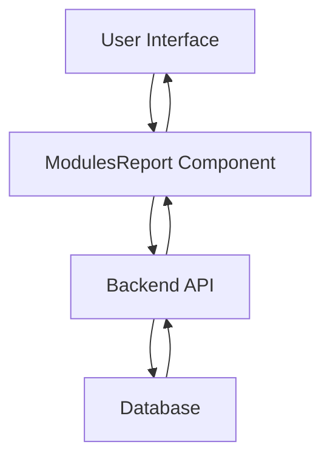
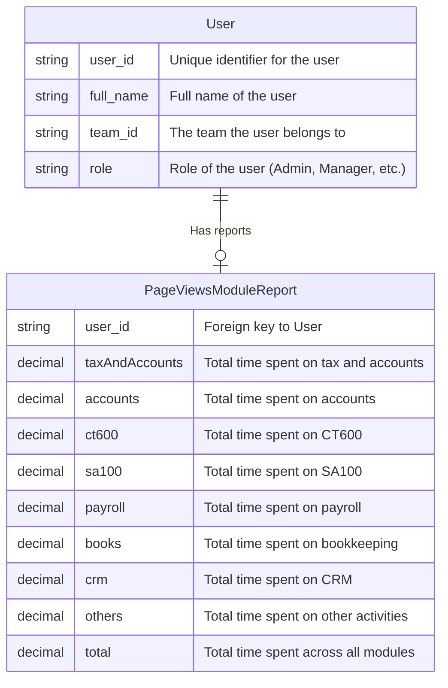

# Modules Report API and Frontend Integration

## Overview

This document outlines the implementation of the **Modules Report** feature. The feature allows fetching and displaying user-wise module data (such as Tax, Payroll, Accounts, etc.) for a specified period. It includes filtering, sorting, and paging functionality, using **TimesheetService** for backend interaction and React components for frontend display.

---

## DFD (Data Flow Diagram)

### Level 1 DFD

### DFD Explanation:

1. **User Interface** (Frontend):
   - The user interacts with the application via the **ModulesReport** React component. They can filter data by date, team, and sort the results.
   
2. **ModulesReport Component**:
   - Handles user interactions and sends filtered parameters (like team and date) to the backend API.
   
3. **Backend API**:
   - The backend processes the request, retrieves data from the database using aggregation queries, and sends it back to the frontend.
   
4. **Database**:
   - MongoDB is used to store the timesheet data. Aggregation queries are executed to retrieve the required data, grouped by user and module.

---

## Process Flow

1. **User Interaction**:
   - The user selects filters for the report (team, from-date, to-date).
   
2. **API Call**:
   - The frontend makes an API request to the backend to fetch the data based on selected filters.
   
3. **Data Processing**:
   - The backend processes the filters and aggregates the data from the MongoDB database.
   
4. **Response**:
   - The backend returns the aggregated data (by user, team, and modules) in a paginated format.
   
5. **Display Data**:
   - The frontend component displays the data in a table format, allowing further interaction with the report (e.g., sorting and paging).

6. **User Interaction with Report**:
   - Users can click on links in the table to view detailed timesheet entries.

---

## ER Diagram

---

## Entity Definition

### `User`
- **user_id** (string): Unique identifier for the user.
- **full_name** (string): Full name of the user.
- **team_id** (string): The team ID to which the user belongs.
- **role** (string): Role of the user (e.g., Admin, Manager, Staff).

### `PageViewsModuleReport`
- **user_id** (string): Foreign key reference to the `User` entity.
- **taxAndAccounts** (decimal): Total time spent on tax and accounts.
- **accounts** (decimal): Total time spent on accounts.
- **ct600** (decimal): Total time spent on CT600.
- **sa100** (decimal): Total time spent on SA100.
- **payroll** (decimal): Total time spent on payroll.
- **books** (decimal): Total time spent on bookkeeping.
- **crm** (decimal): Total time spent on CRM.
- **others** (decimal): Total time spent on other activities.
- **total** (decimal): Total time spent across all modules.

---

# Authentication / APIs

### Authentication
The **Team Report** endpoint requires an **ADMIN** or **MANAGER** role to access. The backend is protected using role-based access control (RBAC) with the `[Authorize]` attribute.

### API Endpoints

| **Description**                    | **HTTP Method**               | **Endpoint**                                                                 |
|------------------------------------|-------------------------------|-----------------------------------------------------------------------------|
| **Get Teams Report List**          | GET                           | [/TeamsReport](https://apiuat.actingoffice.com/api-docs/index.html?urls.primaryName=Acting+Office+-+CRM) |
| **Get Team Report (Members)**      | GET                           | [/teamsreport/{teamId}/TeamReport](https://apiuat.actingoffice.com/api-docs/index.html?urls.primaryName=Acting+Office+-+CRM) |

---

## Testing Guide

### Unit Testing
- **Frontend**: Tests should cover the filtering, sorting, and paging behavior of the `ModulesReport` component.
  - **Test Case 1**: Verify that the data is displayed correctly when a filter is applied (team, date).
  - **Test Case 2**: Verify that sorting by column works correctly.
  - **Test Case 3**: Ensure the total time for each module is calculated correctly.
  
- **Backend**: Unit tests should cover the correct functionality of the `GetModuleReportList` API endpoint.
  - **Test Case 1**: Test that the API correctly filters data by team and date range.
  - **Test Case 2**: Ensure the aggregation logic is working for each module (Tax, Payroll, etc.).
  - **Test Case 3**: Verify that the correct response format is returned, including the pagination and totals.

### Integration Testing
- **Frontend & Backend Integration**: Simulate user actions (like selecting a date range) and test the data flow from the frontend to the backend and back. Ensure that the data is displayed correctly on the UI after interacting with the API.

---

## References
- **[API Documentation](https://apiuat.actingoffice.com/api-docs/index.html?urls.primaryName=Acting+Office+-+CRM)**

