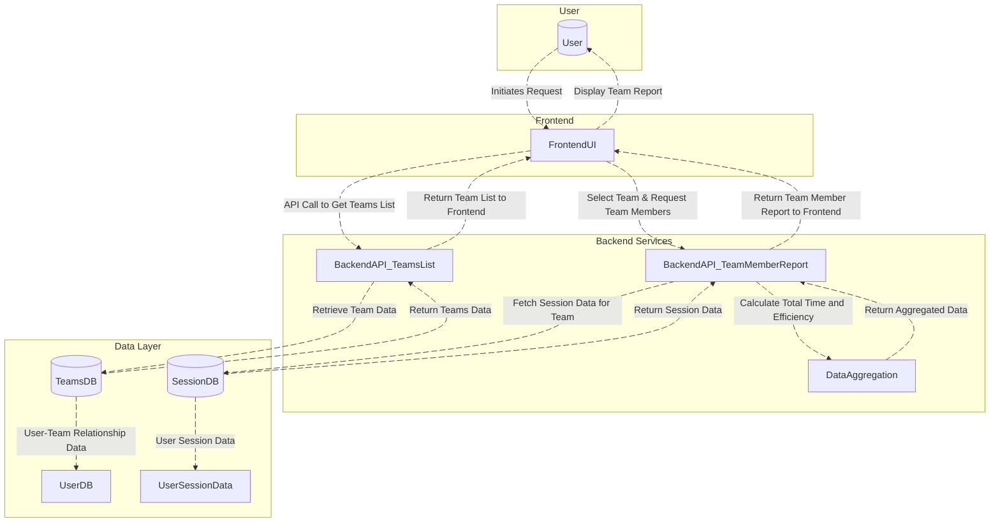
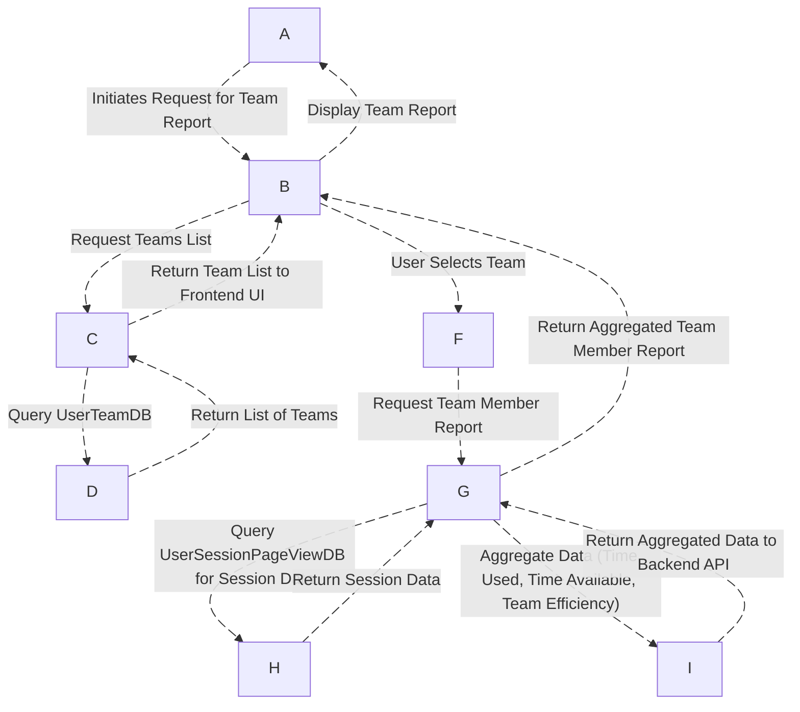
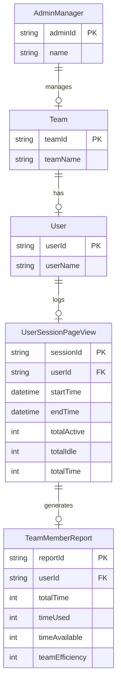

# Teams Report Documentation

 ### **Overview**:

The Teams Report system is designed to provide administrators and managers with comprehensive insights into team performance over a specified period. It aggregates various data points, such as total active and idle times, efficiency, and availability, to generate detailed reports for each team member. The system allows for customizable date ranges and the option to include or exclude weekends in the calculations. By providing a clear overview of how teams and their members are performing, the Teams Report helps identify areas for improvement, track productivity, and assess overall team efficiency. This tool ensures that team leaders and managers can make data-driven decisions based on real-time performance metrics.

### Key Features:

- **Team Efficiency**: Shows how effectively the team used its available time.
- **Customizable Date Range**: Admin can define the start and end dates for the report.
- **Weekend Inclusion**: Option to include/exclude weekends from the report.
- **Member Details**: Displays detailed metrics for each team member, including time worked, efficiency, and available time.

# DFD (Data Flow Diagram)

This diagram outlines the data flow between various components of the system, showing how the admin/manager interacts with the UI, the communication and reports modules, and other key features.

# Process Flow for Teams Report Workflow

### 1. User Requests Team Report
- The **Admin/Manager User** initiates the process by interacting with the **Frontend UI**.
- The user selects filters like date ranges and whether weekends should be included in the report.

### 2. Fetching Teams List
- The **Frontend UI** sends a **GET** request to the **Backend API** to fetch the list of teams.
- The **Backend API** queries the **UserTeamDB** to fetch the list of available teams for the organization.
- The **Backend API** returns the list of teams back to the **Frontend UI**.

### 3. User Selects Team
- The **Admin/Manager User** selects a specific team from the displayed list of teams.
- The **Frontend UI** captures the selected team and prepares for the next request to fetch team member data.

### 4. Fetching Team Member Data
- The **Frontend UI** sends a **GET** request to the **Backend API** to fetch the members of the selected team.
- The **Backend API** queries the **UserSessionPageViewDB** to fetch session data (active time, idle time, etc.) for the selected team members.

### 5. Aggregating Data
- The **Backend API** processes the session data to calculate the following metrics for each team member:
    - **Time Used**: Total active time spent by the member.
    - **Time Available**: The total working hours for the member.
    - **Team Efficiency**: The efficiency based on the ratio of time used to time available.

### 6. Returning Data
- The backend aggregates the session data and returns the **Team Member Report**, including the calculated metrics.
- The report is sent back to the **Frontend UI** for display.

### 7. Display Team Report
- The **Frontend UI** displays the **Team Member Report** to the **Admin/Manager User**.
- The report includes details like **Time Used**, **Time Available**, and **Team Efficiency** for each member.

### 8. User Interaction and Customization
- The **Admin/Manager User** can modify filters or select a different team, which triggers a new request to the backend for updated data.

---

# ER Diagram

## Entity Relationship Diagram (ERD) for Team Report Workflow

The following ER diagram illustrates the relationships between various entities in the workflow of generating a team report, specifically focusing on the aggregation of team member activity data.

### Entities:

1. **Admin/Manager**:
   - Represents the user (typically an admin or manager) who initiates the request for the team report.
   - **Attributes**:
     - `adminId` (PK): Unique identifier for the admin/manager.
     - `name`: Name of the admin/manager.

2. **Team**:
   - Represents a team within an organization. A team contains multiple users (team members).
   - **Attributes**:
     - `teamId` (PK): Unique identifier for the team.
     - `teamName`: Name of the team.

3. **User**:
   - Represents an individual team member.
   - **Attributes**:
     - `userId` (PK): Unique identifier for the user.
     - `userName`: Name of the user.

4. **UserSessionPageView**:
   - Represents a user’s session data. This entity tracks a user’s session start and end times, as well as the total active time, idle time, and overall time spent.
   - **Attributes**:
     - `sessionId` (PK): Unique identifier for the session.
     - `userId` (FK): The user who this session belongs to (foreign key).
     - `startTime`: The session start time.
     - `endTime`: The session end time.
     - `totalActive`: Total active time during the session.
     - `totalIdle`: Total idle time during the session.
     - `totalTime`: Total time for the session (active + idle).

5. **TeamMemberReport**:
   - Represents a report that summarizes each team member's performance. It includes metrics such as total time, time used, time available, and team efficiency.
   - **Attributes**:
     - `reportId` (PK): Unique identifier for the report.
     - `userId` (FK): The user associated with this report (foreign key).
     - `totalTime`: The total available time for the user.
     - `timeUsed`: The actual time used by the user.
     - `timeAvailable`: The available time left after deducting time used.
     - `teamEfficiency`: The efficiency of the user as a percentage of time used vs. available time.

### Relationships:

- **Admin/Manager** manages **Teams**: An admin or manager oversees one or more teams, and they initiate the request for team reports.
- **Team** contains **Users**: Each team consists of multiple users or team members.
- **User** has **UserSessionPageView** records: Each user has one or more session records that track their activity.
- **UserSessionPageView** generates **TeamMemberReport**: The data from a user’s session is aggregated to create a report summarizing their performance.

# Authentication / APIs

### Authentication
The **Team Report** endpoint requires an **ADMIN** or **MANAGER** role to access. The backend is protected using role-based access control (RBAC) with the `[Authorize]` attribute.

### API Endpoints

| **Description**                    | **HTTP Method**               | **Endpoint**                                                                 |
|------------------------------------|-------------------------------|-----------------------------------------------------------------------------|
| **Get Teams Report List**          | GET                           | [/TeamsReport](https://apiuat.actingoffice.com/api-docs/index.html?urls.primaryName=Acting+Office+-+CRM) |
| **Get Team Report (Members)**      | GET                           | [/teamsreport/{teamId}/TeamReport](https://apiuat.actingoffice.com/api-docs/index.html?urls.primaryName=Acting+Office+-+CRM) |

# Testing Guide:

### 1. **Data Fetching Tests:**
   - **Teams List API**: Ensure the list of teams returns correct data.
   - **Team Report API**: Verify that detailed team data is fetched based on selected team ID and date range.

### 2. **Frontend Interaction Tests:**
   - **Team Selection**: Ensure selecting a team fetches and displays its report.
   - **Date Range**: Validate that the date range selection updates the displayed report.
   - **Weekend Toggle**: Check if toggling the "Include weekends" option updates the report accordingly.

### 3. **Data Integrity Tests:**
   - **Session Aggregation**: Confirm that total time used is correctly aggregated from session data.
   - **Efficiency Calculation**: Validate that team efficiency is calculated as a percentage (0-100%).

### 4. **Performance Testing:**
   - Test the system’s performance with larger datasets (many members and a wide date range).

### 5. **Error Handling:**
   - Verify that the system displays appropriate error messages for invalid inputs or backend failures without crashing.

# **References**

- **[API Documentation](https://apiuat.actingoffice.com/api-docs/index.html?urls.primaryName=Acting+Office+-+CRM)**

