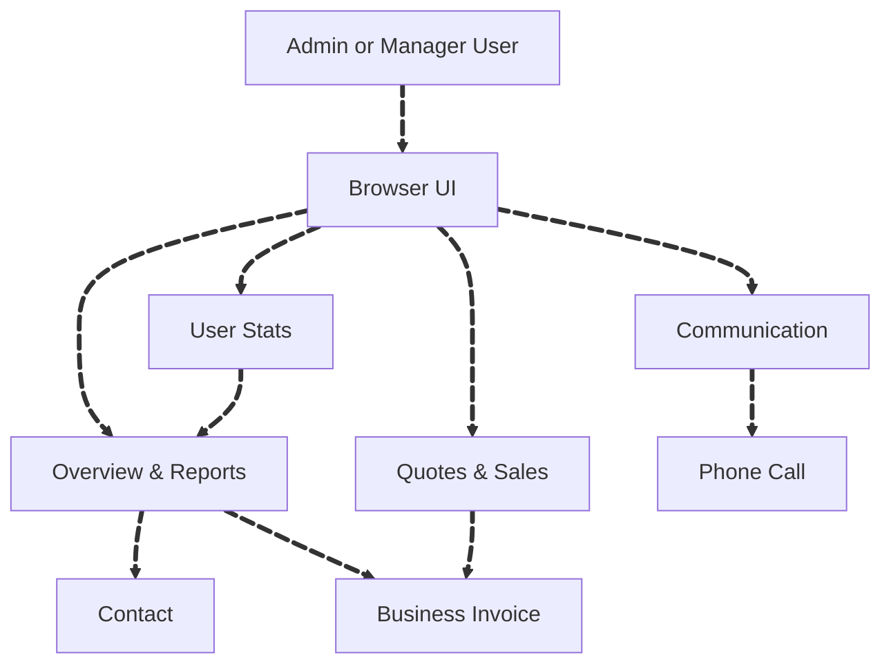

# Team Report Documentation

## Overview
The **Team Report** module aggregates and presents time usage, efficiency, and availability for each team member. This report is designed for managers and administrators to monitor team performance over a specified period.

### Key Features
- Displays time usage statistics for each team member, including total time, time used, and available time.
- Calculates team efficiency based on fixed daily time versus actual time used.
- Allows for filtering by date range, including options to include or exclude weekends.

## DFD (Data Flow Diagram)

## Process Flow

### 1) Admin/Manager Accesses Dashboard

## ER Diagram

## Entity Definitions

- **TeamMemberReport**: Represents the individual report for each team member.
  - `Member`: The team member's name and ID.
  - `TotalTime`: The total fixed time allocated for the member (8 hours 30 minutes per day).
  - `TimeUsed`: The actual time the member worked.
  - `TimeAvailable`: The remaining time the member could potentially work.
  - `TeamEfficiency`: The efficiency percentage based on actual time worked versus allocated time.

- **TeamMemberReportSummary**: Represents the overall summary of the team.
  - `TotalTeams`: The total number of teams.
  - `TotalHours`: The total available hours for all team members combined.
  - `AverageHours`: The average hours worked per team member.
  - `TotalTimeAvailable`: The total available time for the team.
  - `TeamEfficiency`: The overall efficiency percentage for the team.

## Authentication / APIs

### Authentication
The **Team Report** endpoint requires an **ADMIN** or **MANAGER** role to access. The backend is protected using role-based access control (RBAC) with the `[Authorize]` attribute.

### API Endpoints

- **GetTeamReport (Backend)**  
  **Method:** `GET`  
  **Endpoint:** `/teamsreport/{teamId}/TeamReport`  
  **Query Parameters:**
  - `teamId`: The ID of the team to retrieve the report for.
  - `fromDate`: The start date for the report.
  - `toDate`: The end date for the report.
  - `isWeekendIncluded`: A boolean flag to include/exclude weekends.

### Frontend API Call:
- **Route**: `/teamsreport`
- **Method**: `GET`
- **Parameters**:
  - `start`, `length`, `search`, `sortCol`, `sortDir`, `fromDate`, `toDate`

### Backend Method:
- **Route**: `/{teamId}/TeamReport`
- **Method**: `GET`
- **Parameters**:
  - `teamId`: The ID of the team
  - `fromDate`: Start date for the report (optional)
  - `toDate`: End date for the report (optional)
  - `isWeekendIncluded`: Boolean flag to include/exclude weekends (optional)

## Testing Guide

1. **Unit Tests**:  
   The backend API can be unit tested by mocking database calls to simulate various scenarios, such as valid/invalid team IDs and date ranges. Ensure that the time calculations are correct, especially for team efficiency.

2. **Frontend Tests**:  
   Test the frontend using component testing tools like **React Testing Library**. Ensure that the time filters work correctly and that the team data is fetched and displayed properly.

3. **Integration Tests**:  
   Ensure that the frontend can communicate with the backend API and that the correct data is displayed on the dashboard.

## References
- **API Documentation**:  
   Refer to the backend API documentation for detailed information about the Team Report endpoints and data structures.
  
- **Frontend Code**:  
   The frontend code for fetching and displaying the team report is located in `NewTeamsReport.tsx`. The frontend interacts with the backend API to retrieve and display data based on the selected filters.

---

