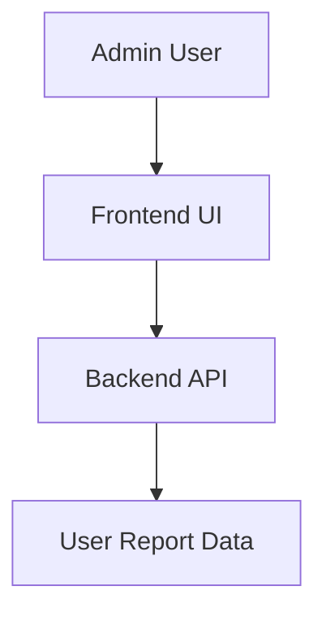
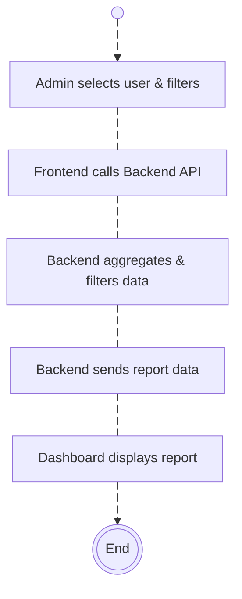
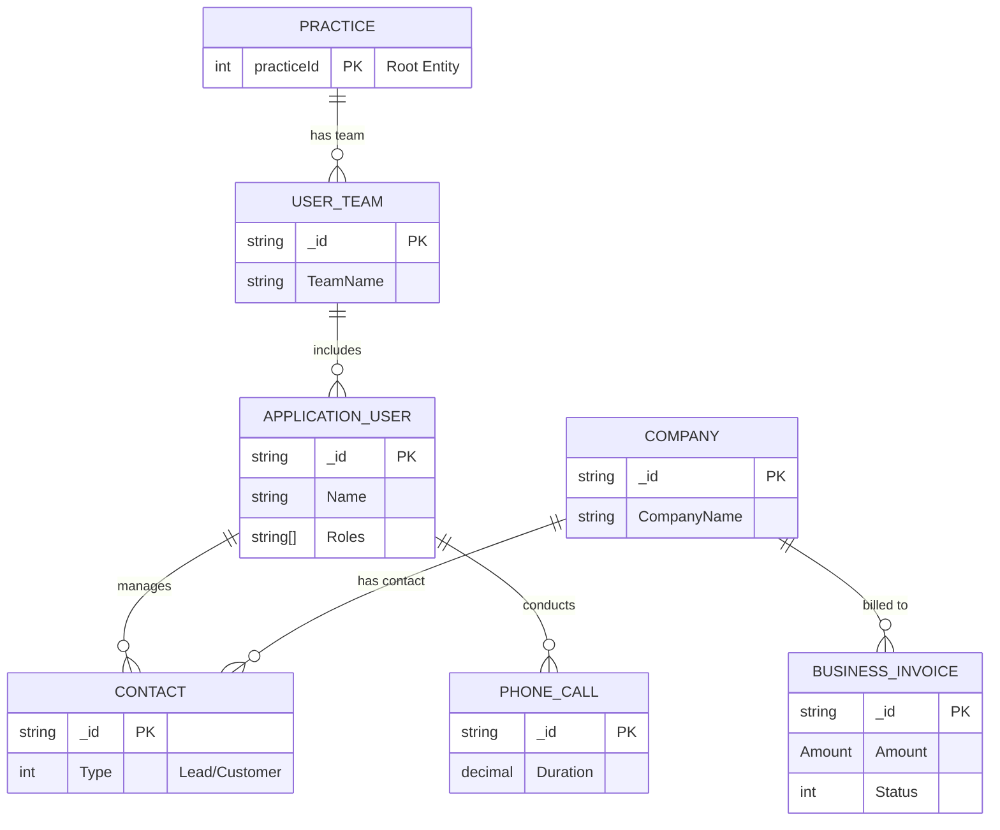

# User Report Documentation

## Overview
The **User Report** API and frontend module allows the generation of detailed reports related to user activities, communications, and other relevant metrics across various application modules such as Tax and Accounts, Payroll, Bookkeeping, CRM, and more.

This document covers:
- **Backend Implementation**: RESTful API to fetch user-specific reports.
- **Frontend Implementation**: Components to display user reports interactively in the admin dashboard.

## DFD (Data Flow Diagram)

The Data Flow Diagram (DFD) illustrates the interaction between the Admin User, Frontend UI, Backend API, and User Report Data.

# Process Flow for User Report Display

### Description of the Process Flow

This process flow describes how an Admin or Manager interacts with the dashboard to view team or member reports. The steps in this process are as follows:

1. **Start**: The process begins when the Admin or Manager starts the interaction.
2. **Admin Selects User & Filters**: The Admin or Manager selects a user and applies filters (e.g., date range, team, etc.) to narrow down the data.
3. **Frontend Calls Backend API**: Once the user is selected and the filters are applied, the frontend sends a request to the backend API to retrieve the data.
4. **Backend Aggregates & Filters Data**: The backend processes the data according to the applied filters, aggregates it based on the user session, and prepares it for display.
5. **Backend Sends Report Data**: After the data is aggregated and filtered, the backend sends the report data back to the frontend.
6. **Dashboard Displays Report**: The frontend receives the data and displays the team or member report in a visual format on the dashboard.
7. **End**: The process ends when the report is displayed successfully to the Admin or Manager.

### Process Flow Diagram

## ER Diagram

## Entity Definition
- **User**: Represents the user initiating the report. Contains properties like `userId`, `userName`, and associated modules for tracking activities.
- **Report**: Contains the aggregated report data for each user, including hours spent across various modules like Tax and Accounts, Payroll, CRM, etc.
- **Activity**: Represents individual activities by the user, such as time spent on different application modules.

## Authentication / APIs

### Authentication
The **Team Report** endpoint requires an **ADMIN** or **MANAGER** role to access. The backend is protected using role-based access control (RBAC) with the `[Authorize]` attribute.

### API Endpoints

| **Description**                   | **HTTP Method**   | **Endpoint**                                                                 |
|-----------------------------------|-------------------|-----------------------------------------------------------------------------|
| **Get User Report**     | GET               | [/userreport](https://apiuat.actingoffice.com/api-docs/index.html?urls.primaryName=Acting+Office+-+CRM) |

## Testing Guide
### Backend Testing:
1. Test the API with different combinations of filters (`userId`, `fromDate`, `toDate`, `sortCol`, etc.).
2. Validate data integrity by comparing the API's response with expected results.

### Frontend Testing:
1. **Unit Tests**: Use React testing libraries to verify if components correctly handle data input and render the report data.
2. **Integration Tests**: Test the integration between the frontend and backend, ensuring the API data is rendered correctly in the frontend components.

### Sample Test Case:
- **Scenario**: Requesting a report for a specific user for the past month.
- **Expected Outcome**: The backend should correctly filter data based on the user and date range. The frontend should display the data without errors.

## References
- **API Documentation**: [Backend API documentation link]
- **Frontend Implementation**: [Link to frontend component files]
