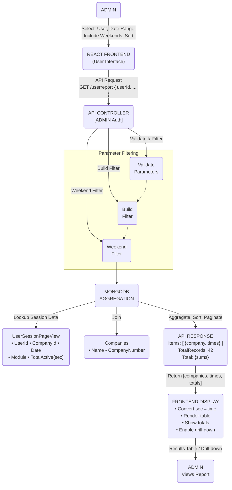
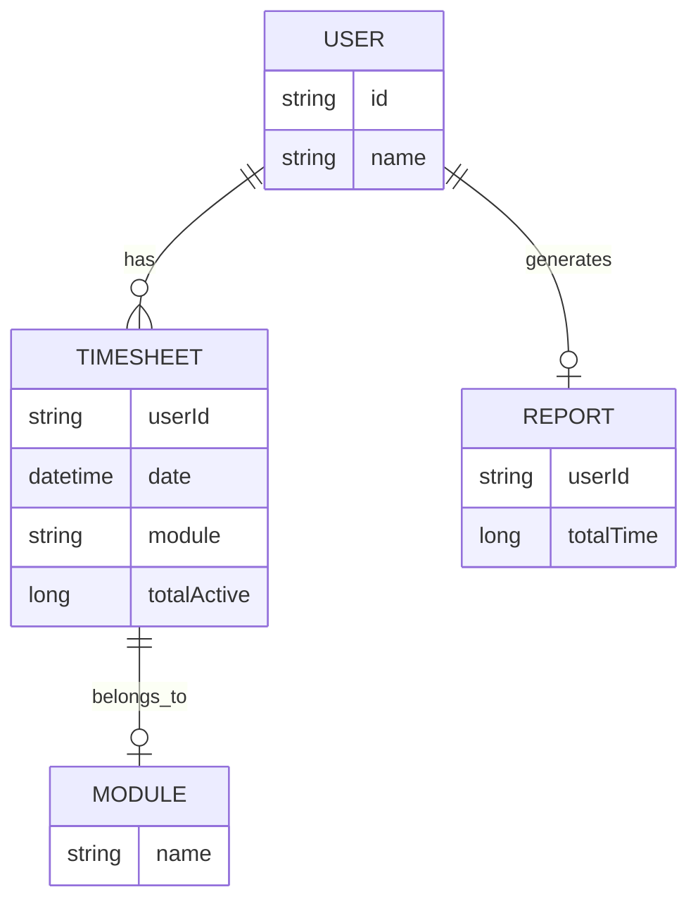

# User Report Documentation

## Overview

The workflow for the User Report involves retrieving and presenting detailed timesheet information for users, including various modules like Tax & Accounts, Payroll, Bookkeeping, CRM, and others. The frontend interfaces with the backend API to filter, retrieve, and display the data.

The React frontend requests user timesheet data, passing filters such as userId, fromDate, toDate, includeWeekends, and sorting preferences. The backend API (/userreport) processes this request by querying a MongoDB database, filtering data based on the provided parameters, aggregating the data, and then sending it back to the frontend. The frontend then displays this data in a paginated table with additional features such as sorting, filtering by users, and viewing details for specific modules.
## DFD (Data Flow Diagram)

# Process Flow for User Report Display

### Description of the Process Flow

This process flow describes how an Admin or Manager interacts with the dashboard to view team or member reports. The steps in this process are as follows:

1. **Start**: The process begins when the Admin or Manager starts the interaction.
2. **Admin Selects User & Filters**: The Admin or Manager selects a user and applies filters (e.g., date range, team, etc.) to narrow down the data.
3. **Frontend Calls Backend API**: Once the user is selected and the filters are applied, the frontend sends a request to the backend API to retrieve the data.
4. **Backend Aggregates & Filters Data**: The backend processes the data according to the applied filters, aggregates it based on the user session, and prepares it for display.
5. **Backend Sends Report Data**: After the data is aggregated and filtered, the backend sends the report data back to the frontend.
6. **Dashboard Displays Report**: The frontend receives the data and displays the team or member report in a visual format on the dashboard.
7. **End**: The process ends when the report is displayed successfully to the Admin or Manager.
---
### Process Flow Diagram

# ER Diagram

## Entity Definitions

### 1. **User**
Represents an individual user for whom the timesheet data is retrieved. Each user has an associated unique identifier (`id`) and a name.

- **Attributes**:
  - `id` (string): Unique identifier for the user.
  - `name` (string): The name of the user.

### 2. **Timesheet**
Represents an individual timesheet entry for a user. Each entry contains the user's ID, the date of the timesheet entry, the module associated with the entry, and the total active time spent.

- **Attributes**:
  - `userId` (string): The ID of the user associated with this timesheet entry.
  - `date` (datetime): The date when the timesheet entry was logged.
  - `module` (string): The module (e.g., Tax & Accounts, Payroll, etc.) associated with this timesheet entry.
  - `totalActive` (long): The total time (in seconds or minutes) the user has spent on this module.

### 3. **Module**
Represents the different application modules that a user can work on, such as Tax & Accounts, Payroll, CRM, etc.

- **Attributes**:
  - `name` (string): The name of the module (e.g., "Tax & Accounts", "Payroll").

### 4. **Report**
Represents the final aggregated timesheet data for a user. This is a summary of the total time spent by a user across various modules over a defined period.

- **Attributes**:
  - `userId` (string): The ID of the user for whom the report is generated.
  - `totalTime` (long): The total time (sum of timesheet entries) the user has spent across all modules.

## Relationships
- A **User** can have multiple **Timesheet** entries.
- A **Timesheet** entry belongs to one **Module**.
- A **User** generates one **Report**, which aggregates the total time from their timesheet entries.

# Authentication / APIs

### Authentication
The **Team Report** endpoint requires an **ADMIN** or **MANAGER** role to access. The backend is protected using role-based access control (RBAC) with the `[Authorize]` attribute.

### API Endpoints

| **Description**                   | **HTTP Method**   | **Endpoint**                                                                 |
|-----------------------------------|-------------------|-----------------------------------------------------------------------------|
| **Get User Report**     | GET               | [/userreport](https://apiuat.actingoffice.com/api-docs/index.html?urls.primaryName=Acting+Office+-+CRM) |

# Testing Guide
### Backend Testing:
1. Test the API with different combinations of filters (`userId`, `fromDate`, `toDate`, `sortCol`, etc.).
2. Validate data integrity by comparing the API's response with expected results.

### Frontend Testing:
1. **Unit Tests**: Use React testing libraries to verify if components correctly handle data input and render the report data.
2. **Integration Tests**: Test the integration between the frontend and backend, ensuring the API data is rendered correctly in the frontend components.

### Sample Test Case:
- **Scenario**: Requesting a report for a specific user for the past month.
- **Expected Outcome**: The backend should correctly filter data based on the user and date range. The frontend should display the data without errors.

# **References**
- **[API Documentation](https://apiuat.actingoffice.com/api-docs/index.html?urls.primaryName=Acting+Office+-+CRM)**
