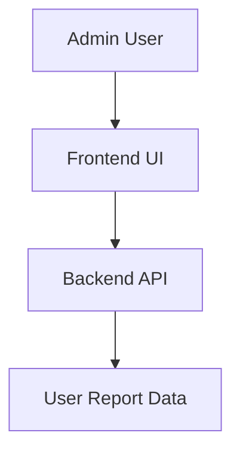
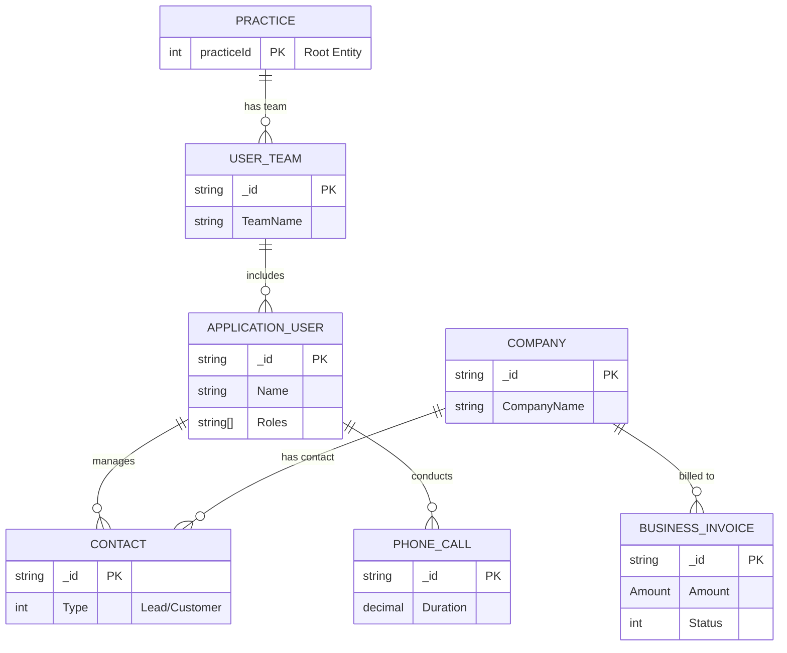

# User Report Documentation

## Overview
The **User Report** API and frontend module allows the generation of detailed reports related to user activities, communications, and other relevant metrics across various application modules such as Tax and Accounts, Payroll, Bookkeeping, CRM, and more.

This document covers:
- **Backend Implementation**: RESTful API to fetch user-specific reports.
- **Frontend Implementation**: Components to display user reports interactively in the admin dashboard.

## DFD (Data Flow Diagram)

## Process Flow

```mermaid
---
config:
  layout: dagre
---
flowchart LR
    Start["Start"] e1@-.-> Select["Admin selects user & filters"]
    Select e2@-.- APICall["Frontend calls Backend API"]
    APICall e3@-.- Aggregate["Backend aggregates & filters data"]
    Aggregate e4@-.- Report["Backend sends report data"]
    Report e5@-.- Render["Dashboard displays report"]
    Render e6@-.-> End["End"]

    Start@{ shape: sm-circ}
    End@{ shape: dbl-circ}

    e1@{ animate: true, curve: natural, animation: fast } 
    e2@{ animate: true } 
    e3@{ animate: true } 
    e4@{ animate: true } 
    e5@{ animate: true } 
    e6@{ animate: true }
```

## ER Diagram

## Entity Definition
- **User**: Represents the user initiating the report. Contains properties like `userId`, `userName`, and associated modules for tracking activities.
- **Report**: Contains the aggregated report data for each user, including hours spent across various modules like Tax and Accounts, Payroll, CRM, etc.
- **Activity**: Represents individual activities by the user, such as time spent on different application modules.

### Frontend API Call:
- **Route**: `/userreport`
- **Method**: `GET`
- **Parameters**:
  - `start`: Pagination start index
  - `length`: Pagination length (number of items per page)
  - `search`: Optional search keyword
  - `sortCol`: Column name to sort by (optional)
  - `sortDir`: Sorting direction (`asc` or `desc`) (optional)
  - `fromDate`: Start date for the report (optional)
  - `toDate`: End date for the report (optional)
  - `userId`: User identifier (optional)

### Backend Method:
- **Route**: `/userreport`
- **Method**: `GET`
- **Parameters**:
  - `userId`: The ID of the user for the report
  - `start`: Start index for pagination (optional)
  - `length`: Number of items per page (optional)
  - `sortCol`: The column to sort by (optional)
  - `sortDir`: Sorting direction (`asc` or `desc`) (optional)
  - `fromDate`: Start date for filtering reports (optional)
  - `toDate`: End date for filtering reports (optional)
  - `isWeekendIncluded`: Boolean flag to include/exclude weekends in the report (optional)

## Testing Guide
### Backend Testing:
1. Test the API with different combinations of filters (`userId`, `fromDate`, `toDate`, `sortCol`, etc.).
2. Validate data integrity by comparing the API's response with expected results.

### Frontend Testing:
1. **Unit Tests**: Use React testing libraries to verify if components correctly handle data input and render the report data.
2. **Integration Tests**: Test the integration between the frontend and backend, ensuring the API data is rendered correctly in the frontend components.

### Sample Test Case:
- **Scenario**: Requesting a report for a specific user for the past month.
- **Expected Outcome**: The backend should correctly filter data based on the user and date range. The frontend should display the data without errors.

## References
- **API Documentation**: [Backend API documentation link]
- **Frontend Implementation**: [Link to frontend component files]
