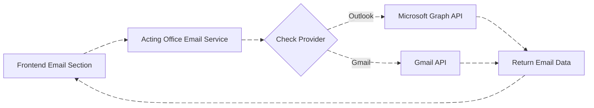

# Acting Office Email System - Technical Documentation

## Table of Contents
1. [Overview](#system-overview)
2. [Architecture Components](#architecture-components)
3. [Email Provider Integration](#email-provider-integration)
4. [Email Module Workflow](#email-module-workflow)
5. [Communication Module Workflow](#communication-module-workflow)
6. [Authentication & Token Management](#authentication--token-management)
7. [Data Models](#data-models)
8. [API Endpoints](#api-endpoints)

---

## 1. System Overview

The Acting Office Email System is a multi-provider email management platform that integrates with both Microsoft Outlook and Google Gmail. The system comprises two primary modules:

- **Email Module**: Handles real-time email operations (inbox, sent items, drafts)
- **Communication Module**: Manages scheduled email communications

### System Architecture

---

## 2. Architecture Components

### 2.1 Backend Services

| Service | Responsibility |
|---------|----------------|
| **Acting Office APIs** | - User authentication - Email provider link/unlink operations - Scheduled communication management - Account status management |
| **Acting Office Email Service** | - Real-time email operations (inbox, sent, drafts) - Email retrieval and sending - Provider-specific API routing |

### 2.2 Database Collections

---

## 3. Email Provider Integration

### 3.1 Provider Initialization Flow

When an admin creates a user, the system initializes the email provider configuration:

### 3.2 Login and Routing Logic

### 3.3 Provider Comparison

| Feature | Microsoft Outlook | Google Gmail |
|---------|------------------|--------------|
| **Provider Enum** | `ApplicationEmailServiceProviders.Outlook` (1) | `ApplicationEmailServiceProviders.Gmail` (0) |
| **Auth Method** | Azure AD OpenID Connect | OAuth 2.0 |
| **Token Storage** | `UserMicrosoftAccessToken` | `UserGoogleAccessToken` |
| **API** | Microsoft Graph API | Gmail API |
| **Subscription Support** | Yes (Inbox & Sent folders) | Watch notifications |

---

## 4. Email Module Workflow

### 4.1 Email Operations Architecture

### 4.2 Inbox Retrieval Flow

The system uses a unified controller with provider-specific routing:

## 5. Communication Module Workflow

### 5.1 Scheduled Email System

The Communication module handles scheduled email sending through the Acting Office APIs service.

### 5.2 Communication Flow States

---

## 6. Authentication & Token Management

### 6.1 Microsoft Outlook Link Flow

### 6.2 Microsoft Outlook Unlink Flow

### 6.3 Token Refresh & Error Handling

## 8. API Endpoints

### 8.1 Microsoft Outlook Endpoints

| Endpoint | Method | Authentication | Description |
|----------|--------|----------------|-------------|
| `/Microsoft/Link` | GET | AllowAnonymous | Initiates OAuth flow to link Outlook account |
| `/Microsoft/AuthCallback` | GET | AllowAnonymous | OAuth callback after successful authentication |
| `/Microsoft/Unlink` | POST | Authorized (ADMIN,MANAGER,STAFF) | Unlinks Outlook account and removes subscriptions |

### 8.2 Email Service Endpoints

| Endpoint | Method | Parameters | Description |
|----------|--------|-----------|-------------|
| `/Inbox` | GET | See Email Controller Parameters | Retrieves email list based on provider |
| `/Send` | POST | Email content & recipients | Sends email through provider |
| `/Draft` | POST | Draft content | Saves email as draft |
| `/Delete` | DELETE | Email ID | Deletes email |
| `/Move` | POST | Email ID, folder | Moves email to folder |

## Appendix B: Common Workflows Summary

| Workflow | Services Involved | User Impact |
|----------|------------------|-------------|
| User Login & Routing | Acting Office APIs | Automatic redirect to appropriate email interface |
| Link Email Account | Acting Office APIs → Azure AD/Google OAuth | User can send/receive emails |
| Unlink Email Account | Acting Office APIs → Provider API | Email features disabled |
| View Inbox | Email Service → Provider API | See emails in unified interface |
| Send Email (Now) | Email Service → Provider API | Immediate delivery |
| Schedule Email | Communication Module → Acting Office APIs | Future delivery with retry |
| Token Refresh | Automatic (Email Service) | Seamless operation |
| Failed Email Recovery | Acting Office APIs (on re-link) | Automatic retry of failed emails |

---

*Document Version: 1.0*  
*Last Updated: December 2025*  
*Acting Office Email System*
