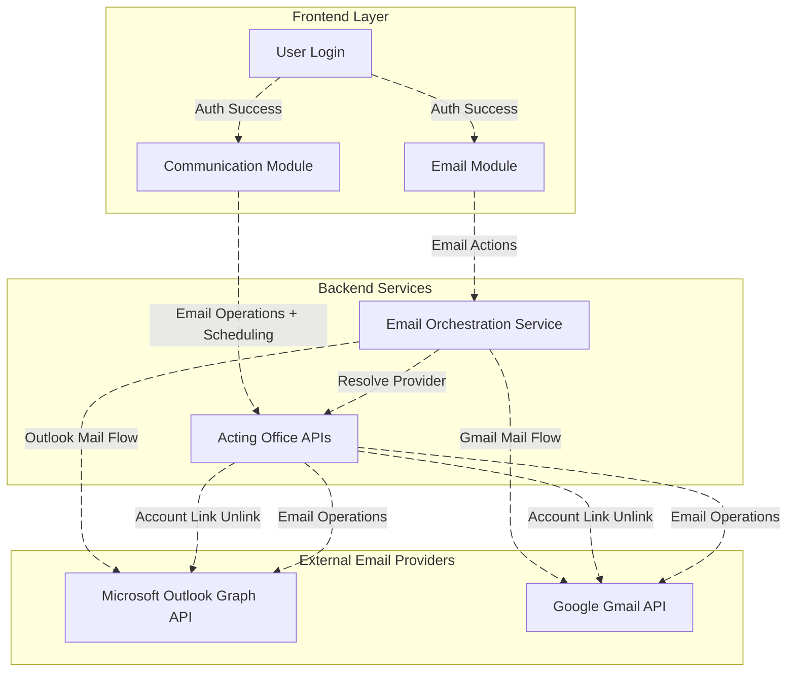

# Acting Office Email System - Technical Documentation

## Table of Contents
1. [Overview](#1-overview)
2. [Data Flow Diagram (DFD)](#2-data-flow-diagram-dfd)
3. [Process Flow](#3-process-flow)
4. [ER Diagram](#4-er-diagram)
5. [Entity Definition](#5-entity-definition)
6. [Authentication](#6-authentication)
7. [APIs](#7-apis)
8. [Testing Guide](#8-testing-guide)
9. [References](#9-references)

---

## 1. Overview

### 1.1 System Introduction

The Acting Office Email System is a multi-provider email management platform that integrates with both Microsoft Outlook and Google Gmail. The system comprises two primary modules with distinct backend services but similar frontend capabilities.

### 1.2 Architecture Components

#### Backend Services

| Service | Purpose | Responsibilities |
|---------|---------|------------------|
| **Acting Office APIs** | Authentication & Communication Backend | • User authentication and authorization • Email provider linking/unlinking operations • Communication (Scheduling) module backend • Token management and storage • Scheduled email delivery tracking • Retry logic for failed deliveries |
| **Acting Office Email Service** | Real-time Email Operations Backend | • Real-time email operations (inbox, sent, drafts) • Email retrieval and display • Email sending and management • Provider-specific API routing (Outlook/Gmail) • Email filtering and categorization |

#### Frontend Modules

| Module | Route | Backend Service | Features |
|--------|-------|----------------|----------|
| **Emails Module** | `/admin/emails` | Acting Office Email Service | • View inbox, sent items, drafts • Send and receive emails • Organize folders/labels • Search and filter emails • Immediate email operations |
| **Communication Module** | `/admin/communication` | Acting Office APIs | • **Same features as Emails Module** • View inbox, sent items, drafts • Send and receive emails • **Additional:** Schedule emails for future delivery • **Additional:** Track scheduled email status • **Additional:** Automatic retry on failures |

### 1.3 Key Module Characteristics

**Emails Module:**
- Backend: Acting Office Email Service
- Purpose: Real-time email management
- Provider Support: Both Outlook and Gmail
- Features: Standard email operations (view, send, organize, search)

**Communication Module:**
- Backend: Acting Office APIs Service
- Purpose: Email management with scheduling capabilities
- Provider Support: Both Outlook and Gmail
- Features: **All features from Emails Module** + scheduling, tracking, and retry logic
- Unique Capability: Schedule emails for future delivery with automatic retry on failures

### 1.4 System Architecture Diagram

---

## 2. Data Flow Diagram (DFD)

### 2.1 Level 0 - Context Diagram

### 2.2 Level 1 - Email Module Data Flow

### 2.3 Level 1 - Communication Module Data Flow

### 2.4 Provider Initialization Data Flow

---

## 3. Process Flow

### 3.1 User Login and Routing

**Login Routing Logic:**
- If provider is Google (0): Navigate to `/admin/emails/google`
- If provider is Outlook: Navigate to `/admin/emails`
- Display Link button if account is unlinked
- Display Unlink button if account is linked

### 3.2 Microsoft Outlook Link Process

**Process Steps:**
1. User initiates link from profile settings
2. System redirects to Azure AD authentication
3. User authorizes application permissions
4. System receives authorization callback
5. Creates email subscriptions (Inbox and Sent folders)
6. Re-queues failed emails from past 15 days
7. Redirects to profile with success message

### 3.3 Microsoft Outlook Unlink Process

**Process Steps:**
1. User initiates unlink from profile
2. System retrieves user access tokens
3. Deletes all Microsoft subscriptions
4. Revokes user sign-in sessions
5. Removes authentication tokens from database
6. Updates user email status to "Not Connected"
7. Sends reconnection notification email

### 3.4 Communication Module - Scheduled Email Workflow

**Workflow Steps:**
1. User creates scheduled email in Communication module
2. Email added to queue with scheduled time
3. Scheduler monitors queue for pending emails
4. At scheduled time, attempts to send email
5. On success: Deletes email from queue
6. On failure: Sends notification to user and retries automatically

### 3.5 Communication Flow States

### 3.6 Token Refresh & Error Handling

**Token Management Strategy:**
- Automatic token validation before each request
- Proactive refresh before expiration (8-minute buffer for Google)
- User notification sent when re-authorization required
- Failed operations queued for retry after re-linking

### 3.7 Inbox Retrieval Process Flow

**Note:** 
- **Email Module:** Routes through Acting Office Email Service
- **Communication Module:** Routes through Acting Office APIs (provides same features)

---

## 4. ER Diagram

### 4.1 Core Entity Relationships

---

## 5. Entity Definition

### 5.1 ApplicationUserAccessTokens

Stores authentication tokens and provider-specific credentials for users.

**Collection Name:** `UserAccessTokens`

| Field | Type | Description |
|-------|------|-------------|
| `Id` | string | Primary Key |
| `User` | IdNameModel | User reference (Id, Name) |
| `EmailProvider` | enum | Provider type (Outlook=1, Gmail=0) |
| `Google` | UserGoogleAccessToken | Google token object |
| `Microsoft` | UserMicrosoftAccessToken | Microsoft token object |
| `LastTokenRefresh` | DateTime | Last token refresh timestamp |
| `EmailAddress` | string | User's email address |
| `GoogleWatchUpdate` | DateTime | Google watch notification update |
| `GmailHistoryId` | ulong | Gmail history tracking ID |
| `Meta` | Dictionary | Additional metadata |
| `PracticeId` | int | Practice reference |

**Purpose:** Central storage for OAuth tokens and provider-specific authentication data.

### 5.2 UserMicrosoftAccessToken

Stores Microsoft-specific authentication and subscription data.

| Field | Type | Description |
|-------|------|-------------|
| `TenantId` | string | Azure AD tenant identifier |
| `ObjectId` | string | Unique account ID |
| `Environment` | string | Identity provider (e.g., login.microsoftonline.com) |
| `TokenCache` | string | Serialized token cache |
| `SubscriptionIdInbox` | string | Inbox notification subscription ID |
| `SubscriptionIdSent` | string | Sent items notification subscription ID |
| `SubscriptionUpdateInbox` | DateTime | Inbox subscription last update |
| `SubscriptionUpdateSent` | DateTime | Sent subscription last update |
| `Status` | UserAccessTokenStatus | Token status (Active, Deleted, NeedApproval) |
| `LastError` | string | Last error message |

**Purpose:** Manages Microsoft Graph API authentication and webhook subscriptions.

### 5.3 UserGoogleAccessToken

Stores Google-specific authentication data.

| Field | Type | Description |
|-------|------|-------------|
| `AccessToken` | string | OAuth access token |
| `RefreshToken` | string | OAuth refresh token |
| `ExpiresInSeconds` | int | Token expiration duration |
| `IssuedUtc` | DateTime | Token issue timestamp (UTC) |
| `Status` | UserAccessTokenStatus | Token status |
| `LastError` | string | Last error message |

**Purpose:** Manages Gmail API authentication with OAuth 2.0 tokens.

### 5.4 ApplicationPractices

Stores practice-level configuration.

**Collection Name:** `ApplicationPractices`

| Field | Type | Description |
|-------|------|-------------|
| `Id` | int | Primary Key |
| `PracticeId` | int | Practice identifier |
| `Name` | string | Practice name |
| `Email` | string | Practice email address |
| `EnableCacheFirst` | bool | Enable cache priority |
| `CacheExpirationTime` | int | Cache expiration (seconds) |

**Purpose:** Organization/tenant configuration and settings.

### 5.5 EmailQueueItem

Stores scheduled emails for the Communication module.

**Collection Name:** `EmailQueueItems`

| Field | Type | Description |
|-------|------|-------------|
| `Id` | string | Primary Key |
| `UserId` | string | User who scheduled email |
| `PracticeId` | int | Practice reference |
| `Provider` | ApplicationEmailServiceProviders | Email provider |
| `ScheduledTime` | DateTime | Scheduled delivery time |
| `Recipients` | List<string> | Email recipients |
| `Subject` | string | Email subject |
| `Body` | string | Email body content |
| `Status` | string | Queue status (Queued, Processing, Sent, Failed) |
| `RetryCount` | int | Number of retry attempts |
| `ErrorType` | EmailQueueItemErrorTypes | Error classification |
| `CreatedBy` | AuditInfo | Creation audit info |

**Purpose:** Queue management for scheduled email delivery in Communication module.

### 5.6 EmailQueueItemError

Tracks failed email delivery attempts.

**Collection Name:** `EmailQueueItemErrors`

| Field | Type | Description |
|-------|------|-------------|
| `Id` | string | Primary Key |
| `UserId` | string | User reference |
| `PracticeId` | int | Practice reference |
| `Provider` | ApplicationEmailServiceProviders | Email provider |
| `ErrorType` | EmailQueueItemErrorTypes | Error type (Reauthorize, etc.) |
| `Date` | DateTime | Error occurrence date |
| `ErrorMessage` | string | Error details |
| `CreatedBy` | AuditInfo | Creation audit info |

**Purpose:** Track failed emails for retry after account re-linking (15-day retention).

### 5.7 Enumerations

#### ApplicationEmailServiceProviders
- `Gmail = 0`
- `Outlook = 1`

#### UserAccessTokenStatus
- `Active` - Token valid and operational
- `Deleted` - Token revoked or removed
- `NeedApproval` - User action required

#### EmailQueueItemErrorTypes
- `Reauthorize` - Authentication required
- `InvalidRecipient` - Invalid email address
- `QuotaExceeded` - Provider quota limit reached
- `NetworkError` - Network connectivity issue
- `Unknown` - Unclassified error

#### ApplicationUserEmailStatus
- `NotConnected` - No provider linked
- `Connected` - Provider successfully linked
- `NeedApproval` - Re-authorization required

---

## 6. Authentication

### 6.1 Authentication Overview

The system uses OAuth 2.0 / OpenID Connect for email provider authentication:

**Microsoft Outlook:**
- Protocol: Azure AD OpenID Connect
- Authentication Flow: Authorization Code Flow
- Token Management: Access tokens with refresh capability
- Subscription Support: Webhook subscriptions for real-time notifications

**Google Gmail:**
- Protocol: OAuth 2.0
- Authentication Flow: Web Server Flow
- Token Management: Access tokens with refresh capability
- Notification Support: Push notifications via Pub/Sub

### 6.2 Authentication Flow

**Common Process for Both Providers:**

1. **Initiation:** User clicks "Link Account" button in profile settings
2. **Redirect:** System redirects to provider authentication page
3. **Authorization:** User authorizes Acting Office application
4. **Callback:** Provider redirects back with authorization code
5. **Token Exchange:** System exchanges code for access/refresh tokens
6. **Storage:** Tokens stored in ApplicationUserAccessTokens collection
7. **Status Update:** User email status updated to "Connected"
8. **Subscription:** Email subscriptions/watches created (if applicable)

### 6.3 Microsoft Authentication Process

**Link Account Steps:**
1. System initiates Azure AD authentication challenge
2. User redirected to Microsoft login page
3. User enters credentials and grants permissions
4. Azure AD redirects to callback endpoint with auth code
5. System exchanges code for tokens via Microsoft Identity platform
6. Creates Graph API subscriptions for Inbox and Sent folders
7. Re-queues failed emails from past 15 days
8. Redirects user to profile with success message

**Unlink Account Steps:**
1. System retrieves user access tokens from database
2. Deletes all Microsoft Graph subscriptions
3. Revokes user sign-in sessions via Graph API
4. Removes authentication tokens from database
5. Updates user email status to "Not Connected"
6. Sends reconnection notification email to user

### 6.4 Google Authentication Process

**Link Account Steps:**
1. System initiates OAuth 2.0 authorization flow
2. User redirected to Google login page
3. User grants permissions to Acting Office
4. Google redirects to callback with authorization code
5. System exchanges code for access and refresh tokens
6. Creates Gmail watch for push notifications
7. Stores tokens in database
8. Updates user status to "Connected"

**Unlink Account Steps:**
1. System retrieves Google access tokens
2. Stops Gmail watch notifications
3. Revokes OAuth tokens via Google API
4. Removes tokens from database
5. Updates user status to "Not Connected"
6. Sends reconnection notification

### 6.5 Token Management

**Token Lifecycle:**
- **Issuance:** Tokens issued during initial authentication
- **Storage:** Encrypted storage in MongoDB with practice-level isolation
- **Caching:** 2-hour distributed cache for performance
- **Refresh:** Automatic refresh before expiration (8-minute buffer for Google)
- **Revocation:** Manual unlink or automatic on authentication errors
- **Re-authorization:** User notified when re-link required

**Token Status Types:**
- **Active:** Token valid and operational
- **Deleted:** Token revoked (manual unlink or error)
- **NeedApproval:** User must re-authorize

**Error Handling:**
- Authentication failures trigger status change to "NeedApproval"
- User receives email notification with re-link instructions
- Failed emails (with ErrorType.Reauthorize) retained for 15 days
- Upon re-linking, failed emails automatically re-queued

### 6.6 Security Measures

**Token Security:**
- Encrypted storage in MongoDB
- Practice-level data isolation
- Secure token refresh mechanism
- Automatic expiration and rotation

**Access Control:**
- Role-based authorization (ADMIN, MANAGER, STAFF)
- JWT-based API authentication
- User-specific token access
- Cross-user access prevention

**Account Protection:**
- Sign-in session revocation on unlink
- Subscription cleanup on disconnect
- Audit trail for link/unlink operations
- Email notifications for account changes

---

## 7. APIs

### 7.1 API Overview

The Acting Office Email System provides RESTful APIs organized into two main categories:

**Authentication APIs (Acting Office APIs Service):**
- Microsoft/Google account linking
- Account unlinking
- Token management
- Status updates

**Email Operation APIs:**
- Inbox retrieval (Email Service for Email Module)
- Email operations with scheduling (APIs Service for Communication Module)
- Email sending and management
- Search and filtering

### 7.2 Microsoft Outlook API Endpoints

**Authentication Endpoints:**

| Endpoint | Method | Purpose |
|----------|--------|---------|
| `/Microsoft/Link` | GET | Initiates OAuth flow to link Outlook account |
| `/Microsoft/AuthCallback` | GET | Handles OAuth callback after authentication |
| `/Microsoft/Unlink` | POST | Unlinks Outlook account and removes subscriptions |

**Key Features:**
- Anonymous access for Link and Callback (OAuth flow)
- Role-based authorization for Unlink (ADMIN, MANAGER, STAFF)
- Automatic subscription management
- Failed email re-queuing on successful link

### 7.3 Google Gmail API Endpoints

**Authentication Endpoints:**

| Endpoint | Method | Purpose |
|----------|--------|---------|
| `/Google/Link` | GET | Initiates OAuth 2.0 flow to link Gmail account |
| `/Google/AuthCallback` | GET | Handles OAuth callback |
| `/Google/Unlink` | POST | Unlinks Gmail account and stops watch |

**Key Features:**
- OAuth 2.0 authorization flow
- Push notification watch management
- Token refresh handling
- Account status synchronization

### 7.4 Email Service API Endpoints

**Email Module (Acting Office Email Service):**

| Endpoint | Method | Purpose |
|----------|--------|---------|
| `/Emails/Inbox` | GET | Retrieve inbox emails with filtering |
| `/Emails/Send` | POST | Send email immediately |
| `/Emails/Draft` | POST | Save email as draft |
| `/Emails/Delete` | DELETE | Delete email |
| `/Emails/Move` | POST | Move email to folder |
| `/Emails/Search` | GET | Search emails |

**Communication Module (Acting Office APIs):**

| Endpoint | Method | Purpose |
|----------|--------|---------|
| `/Communication/Inbox` | GET | Retrieve inbox with same features as Email Module |
| `/Communication/Send` | POST | Send email immediately |
| `/Communication/Schedule` | POST | Schedule email for future delivery |
| `/Communication/Scheduled` | GET | Get list of scheduled emails |
| `/Communication/Cancel` | DELETE | Cancel scheduled email |

### 7.5 Common API Features

**Authentication:**
- JWT Bearer token authentication
- Role-based access control
- User context validation

**Filtering and Pagination:**
- Start/length pagination
- View type filters (unread, read, all)
- Importance/starred filters
- Attachment filters
- Date range filters
- Category filters
- Sort options

**Provider Routing:**
- Automatic provider detection from user tokens
- Dynamic routing to Outlook or Gmail APIs
- Unified response format regardless of provider

**Error Handling:**
- Standardized error response structure
- HTTP status codes
- Detailed error messages
- Error type classification

### 7.6 Provider Comparison

| Feature | Microsoft Outlook | Google Gmail |
|---------|------------------|--------------|
| **Provider Value** | 1 | 0 |
| **Auth Method** | Azure AD OpenID Connect | OAuth 2.0 |
| **API** | Microsoft Graph API | Gmail API |
| **Real-time Notifications** | Webhook subscriptions | Push notifications |
| **Token Expiration** | Standard OAuth | 8-minute buffer |
| **Supported Features** | All email operations + scheduling | All email operations + scheduling |

### 7.7 Response Format

All APIs return responses in a standardized format:

**Success Response:**
- `result`: Response data (type varies by endpoint)
- `isSuccess`: true
- `errors`: Empty array

**Error Response:**
- `result`: null or partial data
- `isSuccess`: false
- `errors`: Array of error objects with code and message

---

## 8. Testing Guide

### 8.1 Testing Strategy

**Test Levels:**
1. Unit Testing - Individual components and functions
2. Integration Testing - API endpoints and database operations
3. End-to-End Testing - Complete user workflows
4. Performance Testing - Load and stress testing
5. Security Testing - Authentication and authorization

### 8.2 Key Test Scenarios

#### Authentication Testing

**Scenario 1: Link Microsoft Outlook Account**
- Objective: Verify successful account linking
- Steps: Login → Navigate to profile → Click Link button → Authorize → Verify success
- Expected: Token stored, status "Connected", subscriptions created

**Scenario 2: Unlink Microsoft Outlook Account**
- Objective: Verify successful account unlinking
- Steps: Click Unlink → Confirm → Verify status update
- Expected: Subscriptions deleted, tokens removed, notification sent

**Scenario 3: Link Google Gmail Account**
- Objective: Verify Gmail account linking
- Steps: Similar to Outlook with Google OAuth flow
- Expected: Token stored, watch created, status updated

#### Email Module Testing

**Scenario 4: View Inbox**
- Objective: Verify inbox retrieval for both providers
- Steps: Navigate to emails → View inbox → Apply filters
- Expected: Emails displayed, filters work, pagination functional

**Scenario 5: Send Email**
- Objective: Verify immediate email sending
- Steps: Compose email → Add recipients → Send
- Expected: Email sent successfully, appears in sent folder

**Scenario 6: Search and Filter**
- Objective: Verify search and filter functionality
- Steps: Apply various filters and search terms
- Expected: Relevant results returned, filters applied correctly

#### Communication Module Testing

**Scenario 7: Schedule Email**
- Objective: Verify email scheduling functionality
- Steps: Navigate to communication → Schedule email → Set future time
- Expected: Email queued, appears in scheduled list

**Scenario 8: Scheduled Email Delivery**
- Objective: Verify scheduled email sent at correct time
- Steps: Wait for scheduled time → Verify delivery
- Expected: Email sent at scheduled time, removed from queue

**Scenario 9: Failed Email Retry**
- Objective: Verify automatic retry logic
- Steps: Unlink account → Schedule email → Re-link → Verify retry
- Expected: Failed email re-queued and sent after re-link

#### Token Management Testing

**Scenario 10: Token Refresh**
- Objective: Verify automatic token refresh
- Steps: Use expired/near-expired token → Make API request
- Expected: Token automatically refreshed, request succeeds

**Scenario 11: Token Expiration Handling**
- Objective: Verify handling of expired tokens
- Steps: Use expired token → Verify notification sent
- Expected: User notified to re-link account

### 8.3 Performance Testing

**Load Test Scenarios:**

1. **Concurrent Inbox Requests**
   - 100 concurrent users requesting inbox
   - Target response time: < 2 seconds
   - Success rate: > 99%

2. **Bulk Email Scheduling**
   - Schedule 1000 emails across multiple users
   - Verify queue processing efficiency
   - Monitor system resource usage

3. **Token Refresh Under Load**
   - Multiple users with near-expired tokens
   - Simultaneous requests triggering refresh
   - Verify all refreshes succeed

### 8.4 Security Testing

**Test Cases:**

1. **Unauthorized Access Prevention**
   - Attempt access without authentication
   - Expected: 401 Unauthorized

2. **Cross-User Access Prevention**
   - User A tries to access User B's emails
   - Expected: 403 Forbidden

3. **Token Validation**
   - Use invalid or expired tokens
   - Expected: Proper error handling

4. **Input Validation**
   - Test with malicious inputs
   - Expected: Input sanitized, no vulnerabilities

### 8.5 Testing Tools

**Recommended Tools:**
- Postman/Insomnia - API testing
- JMeter/k6 - Load testing
- Selenium - End-to-end testing
- xUnit/NUnit - Unit testing (.NET)
- MongoDB Compass - Database verification

### 8.6 Test Data Management

**Test Accounts:**
- Create dedicated test accounts for Outlook and Gmail
- Use sandbox/test environments when available
- Maintain separate test practice IDs
- Clean up test data after testing

**Database Verification:**
- Monitor token storage and updates
- Verify queue item creation and deletion
- Check subscription/watch status
- Validate audit trails

---

## 9. References

### 9.1 External Documentation

**Microsoft Resources:**
- Microsoft Graph API Documentation
- Azure AD Authentication Documentation
- Outlook Mail API Reference
- Microsoft Identity Platform

**Google Resources:**
- Gmail API Documentation
- Google OAuth 2.0 Documentation
- Gmail Push Notifications Guide
- Google Cloud Platform Console

### 9.2 Technology Stack

| Technology | Purpose |
|------------|---------|
| .NET 8.0 | Backend framework |
| MongoDB | Database storage |
| Redis | Distributed caching |
| Microsoft.Identity.Web | Azure AD authentication |
| Google.Apis.Gmail.v1 | Gmail API client |
| Microsoft.Graph | Graph API client |

### 9.3 Database Collections

| Collection | Purpose |
|------------|---------|
| `ApplicationPractices` | Practice/tenant configuration |
| `UserAccessTokens` | Authentication tokens |
| `ApplicationUserOutlookSubscription` | Outlook webhook subscriptions |
| `EmailQueueItems` | Scheduled emails queue |
| `EmailQueueItemErrors` | Failed email tracking |

### 9.4 Common Workflows Summary

| Workflow | Services Involved | User Impact |
|----------|------------------|-------------|
| User Login & Routing | Acting Office APIs | Automatic redirect based on provider |
| Link Email Account | Acting Office APIs → Provider OAuth | Enable email features |
| Unlink Email Account | Acting Office APIs → Provider API | Disable email features |
| View Inbox (Email Module) | Email Service → Provider API | Real-time email access |
| View Inbox (Communication Module) | Acting Office APIs → Provider API | Email access with scheduling |
| Send Email Immediately | Email Service or APIs → Provider API | Instant delivery |
| Schedule Email | Acting Office APIs → Queue → Provider API | Future delivery with retry |
| Token Refresh | Automatic (Background Service) | Seamless operation |
| Failed Email Recovery | Acting Office APIs (on re-link) | Automatic retry |

### 9.5 System Characteristics

**Scalability:**
- Practice-level data isolation
- Distributed caching for performance
- Queue-based scheduling architecture
- Horizontal scaling capability

**Reliability:**
- Automatic token refresh
- Failed email retry mechanism
- 15-day error retention
- Comprehensive error handling

**Security:**
- OAuth 2.0 / OpenID Connect
- Encrypted token storage
- Role-based access control
- Audit trail for operations

**Maintainability:**
- Modular architecture
- Clear separation of concerns
- Standardized API responses
- Comprehensive logging

---

*Document Version: 2.0*  
*Last Updated: December 2025*  
*Acting Office Email System - Technical Documentation*
