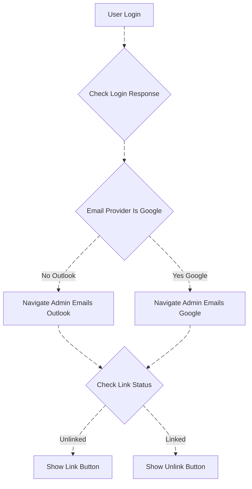
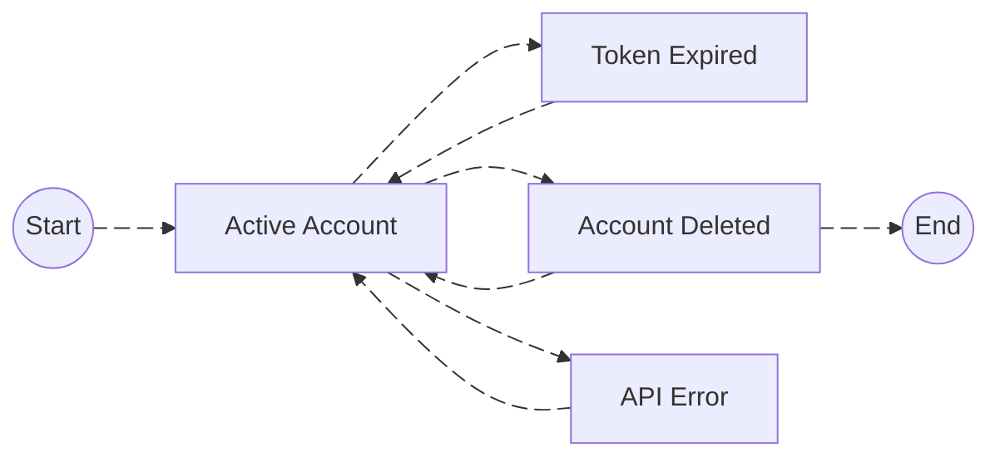

# Acting Office Email System - Technical Documentation

## Table of Contents
1. [System Overview](#system-overview)
2. [Architecture Components](#architecture-components)
3. [Email Provider Integration](#email-provider-integration)
4. [Email Module Workflow](#email-module-workflow)
5. [Communication Module Workflow](#communication-module-workflow)
6. [Authentication & Token Management](#authentication--token-management)
7. [Data Models](#data-models)
8. [API Endpoints](#api-endpoints)

---

## 1. System Overview

The Acting Office Email System is a multi-provider email management platform that integrates with both Microsoft Outlook and Google Gmail. The system comprises two primary modules:

- **Email Module**: Handles real-time email operations (inbox, sent items, drafts)
- **Communication Module**: Manages scheduled email communications

### System Architecture


---

## 2. Architecture Components

### 2.1 Backend Services

| Service | Responsibility |
|---------|----------------|
| **Acting Office APIs** | - User authentication<br>- Email provider link/unlink operations<br>- Scheduled communication management<br>- Account status management |
| **Acting Office Email Service** | - Real-time email operations (inbox, sent, drafts)<br>- Email retrieval and sending<br>- Provider-specific API routing |

### 2.2 Database Collections


---

## 3. Email Provider Integration

### 3.1 Provider Initialization Flow

When an admin creates a user, the system initializes the email provider configuration:


### 3.2 Login and Routing Logic



### 3.3 Provider Comparison

| Feature | Microsoft Outlook | Google Gmail |
|---------|------------------|--------------|
| **Provider Enum** | `ApplicationEmailServiceProviders.Outlook` (1) | `ApplicationEmailServiceProviders.Gmail` (0) |
| **Auth Method** | Azure AD OpenID Connect | OAuth 2.0 |
| **Token Storage** | `UserMicrosoftAccessToken` | `UserGoogleAccessToken` |
| **API** | Microsoft Graph API | Gmail API |
| **Subscription Support** | Yes (Inbox & Sent folders) | Watch notifications |

---

## 4. Email Module Workflow

### 4.1 Email Operations Architecture


### 4.2 Inbox Retrieval Flow

The system uses a unified controller with provider-specific routing:


### 4.3 Email Controller Parameters

The unified email controller (`/Inbox` endpoint) supports the following parameters:

| Parameter | Type | Description | Default |
|-----------|------|-------------|---------|
| `start` | int | Pagination start index | 0 |
| `length` | int | Number of items per page | 35 |
| `search` | string | Search query | null |
| `userId` | string | User identifier | "" |
| `inboxType` | string | Folder type (inbox, sent, drafts) | "inbox" |
| `isImportant` | bool | Filter important emails only | false |
| `viewType` | string | View filter (unread, read, all) | "" |
| `isFlagged` | bool? | Filter flagged emails | null |
| `isStarred` | bool? | Filter starred emails (Gmail) | null |
| `hasAttachment` | bool? | Filter emails with attachments | null |
| `hasMentioned` | bool? | Filter emails where user is mentioned | null |
| `categoryType` | string | Email category filter | null |
| `sortBy` | string | Sort field | "Date" |
| `nextPageToken` | string? | Gmail pagination token | null |
| `startDate` | string? | Date range start | null |
| `endDate` | string? | Date range end | null |

---

## 5. Communication Module Workflow

### 5.1 Scheduled Email System

The Communication module handles scheduled email sending through the Acting Office APIs service.


### 5.2 Communication Flow States


---

## 6. Authentication & Token Management

### 6.1 Microsoft Outlook Link Flow


### 6.2 Microsoft Outlook Unlink Flow


### 6.3 Token Status Management

The system maintains token status using the `UserAccessTokenStatus` enum:



### 6.4 Token Refresh & Error Handling


---

## 7. Data Models

### 7.1 ApplicationUserAccessTokens

Primary model for storing user authentication tokens and email provider information.

```typescript
class ApplicationUserAccessTokens {
    Id: string;                              // Primary key
    User: IdNameModel;                       // User reference
    EmailProvider: ApplicationEmailServiceProviders; // 0=Gmail, 1=Outlook
    Google?: UserGoogleAccessToken;          // Gmail tokens
    Microsoft?: UserMicrosoftAccessToken;    // Outlook tokens
    LastTokenRefresh?: DateTime;             // Last refresh timestamp
    EmailAddress?: string;                   // User's email
    GoogleWatchUpdate?: DateTime;            // Gmail watch update date
    GmailHistoryId?: ulong;                  // Gmail sync point
    Meta?: Dictionary<string, string>;       // Additional metadata
    
    // Methods
    IsGoogleTokenExpired(): boolean;         // Check token expiration
}
```

### 7.2 UserMicrosoftAccessToken

```typescript
class UserMicrosoftAccessToken {
    TenantId?: string;                       // Azure AD tenant
    ObjectId?: string;                       // User object ID
    Environment?: string;                    // Identity provider URL
    TokenCache?: string;                     // Cached ID token
    SubscriptionIdInbox?: string;            // Inbox notification subscription
    SubscriptionIdSent?: string;             // Sent folder notification subscription
    SubscriptionUpdateInbox?: DateTime;      // Inbox subscription update time
    SubscriptionUpdateSent?: DateTime;       // Sent subscription update time
    Status: UserAccessTokenStatus;           // Token status
    LastError?: string;                      // Last error message
    
    // Methods
    GetHomeAccountId(): string;              // Returns "ObjectId.TenantId"
}
```

### 7.3 Database Operations


---

## 8. API Endpoints

### 8.1 Microsoft Outlook Endpoints

| Endpoint | Method | Authentication | Description |
|----------|--------|----------------|-------------|
| `/Microsoft/Link` | GET | AllowAnonymous | Initiates OAuth flow to link Outlook account |
| `/Microsoft/AuthCallback` | GET | AllowAnonymous | OAuth callback after successful authentication |
| `/Microsoft/Unlink` | POST | Authorized (ADMIN,MANAGER,STAFF) | Unlinks Outlook account and removes subscriptions |

### 8.2 Email Service Endpoints

| Endpoint | Method | Parameters | Description |
|----------|--------|-----------|-------------|
| `/Inbox` | GET | See Email Controller Parameters | Retrieves email list based on provider |
| `/Send` | POST | Email content & recipients | Sends email through provider |
| `/Draft` | POST | Draft content | Saves email as draft |
| `/Delete` | DELETE | Email ID | Deletes email |
| `/Move` | POST | Email ID, folder | Moves email to folder |

### 8.3 Provider Routing Logic

```javascript
// Frontend routing on login
if (currentUser.emailStatus?.provider === 0) {
    navigate('/admin/emails/google');  // Gmail provider
} else {
    navigate('/admin/emails');          // Outlook provider
}
```

### 8.4 Backend Provider Resolution

```csharp
// Email Service Controller
if (accessToken.EmailProvider == ApplicationEmailServiceProviders.Outlook) {
    // Route to Microsoft Controller
    var client = _graphSdkHelper.GetAuthenticatedClient(accessToken);
    var res = await MicrosoftController.GetMessages(/* parameters */);
} 
else if (accessToken.EmailProvider == ApplicationEmailServiceProviders.Gmail) {
    // Route to Google Controller
    var controller = new GoogleController(/* dependencies */);
    var res = await controller.GetMessageList(/* parameters */);
}
```

---

## 9. Error Handling & Recovery

### 9.1 Failed Email Queue Recovery

When email sending fails, the system implements an automatic recovery mechanism:


### 9.2 Token Status Notification Flow

When token becomes invalid, the system notifies the user:


### 9.3 Email Template Structure

The notification email includes:
- **Subject**: "Account unlinked"
- **Content**:
  - Logo and branded header
  - Personalized greeting
  - Explanation of why account was unlinked
  - Call-to-action button with profile link
  - Instructions for re-linking
  - Team signature

---

## 10. Key Design Patterns

### 10.1 Service Separation

The system employs clear separation of concerns:


### 10.2 Provider Abstraction

Both Google and Microsoft providers are accessed through a unified interface:

```typescript
interface IEmailProvider {
    GetMessages(/* parameters */): Promise<PagedData<EmailsListItem>>;
    SendMessage(/* parameters */): Promise<SendResult>;
    DeleteMessage(id: string): Promise<boolean>;
    // ... other common operations
}
```

### 10.3 Caching Strategy


---

## 11. Security Considerations

### 11.1 Authentication Requirements

- All email operations require authenticated users with roles: ADMIN, MANAGER, or STAFF
- Link/Unlink operations support both authenticated and unauthenticated scenarios
- Tokens are securely stored with encryption

### 11.2 Token Security


### 11.3 Subscription Management

For Microsoft Outlook:
- Subscriptions are created for both Inbox and Sent folders
- Subscriptions are automatically renewed before expiration
- On unlink, all subscriptions are properly deleted
- Failed subscription deletions are handled gracefully (try-catch)

---

## 12. Best Practices

### 12.1 Error Recovery

1. **Automatic Retry**: Failed emails are automatically queued for retry
2. **User Notification**: Users are notified when manual intervention is required
3. **Graceful Degradation**: System continues functioning even if one provider fails

### 12.2 Token Management

1. **Proactive Refresh**: Tokens are refreshed 480 seconds (8 minutes) before expiration
2. **Status Tracking**: Token status is maintained for monitoring
3. **Cache Optimization**: Frequently accessed tokens are cached for 2 hours

### 12.3 Database Operations

1. **Practice Isolation**: All operations are scoped to practice ID
2. **Efficient Queries**: Indexes on userId and emailProvider
3. **Batch Operations**: Multiple subscriptions handled in loops

---

## Appendix A: Enumerations

### ApplicationEmailServiceProviders
```csharp
enum ApplicationEmailServiceProviders {
    Gmail = 0,
    Outlook = 1
}
```

### UserAccessTokenStatus
```csharp
enum UserAccessTokenStatus {
    Active,
    Expired,
    Deleted,
    Error
}
```

### ApplicationUserEmailStatus
```csharp
enum ApplicationUserEmailStatus {
    Connected,
    NotConnected,
    NeedApproval
}
```

---

## Appendix B: Common Workflows Summary

| Workflow | Services Involved | User Impact |
|----------|------------------|-------------|
| User Login & Routing | Acting Office APIs | Automatic redirect to appropriate email interface |
| Link Email Account | Acting Office APIs → Azure AD/Google OAuth | User can send/receive emails |
| Unlink Email Account | Acting Office APIs → Provider API | Email features disabled |
| View Inbox | Email Service → Provider API | See emails in unified interface |
| Send Email (Now) | Email Service → Provider API | Immediate delivery |
| Schedule Email | Communication Module → Acting Office APIs | Future delivery with retry |
| Token Refresh | Automatic (Email Service) | Seamless operation |
| Failed Email Recovery | Acting Office APIs (on re-link) | Automatic retry of failed emails |

---

*Document Version: 1.0*  
*Last Updated: December 2025*  
*Acting Office Email System*